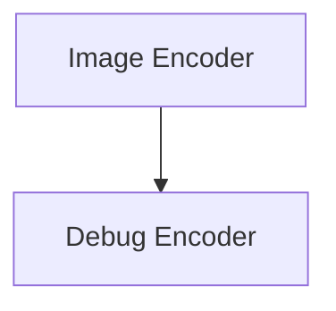

# Image Encoding Operations

## Introduction

This module (`image_encoding_operations`) provides the core functionalities for encoding float images into numerical feature vectors within the `llama_cpp_mtmd_clip` framework. It leverages the CLIP context to process image data, facilitating tasks such as image recognition and similarity search. The module includes both the primary encoding mechanism and a dedicated debugging utility.

## Architecture Overview

The `image_encoding_operations` module consists of two main sub-modules:

1.  **Image Encoder**: Handles the actual conversion of float image data into feature vectors.
2.  **Debug Encoder**: Provides a utility for debugging the image encoding process with dummy image data.

These sub-modules interact with the broader CLIP context and other image processing utilities within the `llama_cpp_mtmd_clip` module.

<!-- DIAGRAM_JSON
{
    "direction": "TD",
    "nodes": [
        {"id": "image_encoder", "label": "Image Encoder", "type": "module", "link": "image_encoder.md"},
        {"id": "debug_encoder", "label": "Debug Encoder", "type": "module", "link": "debug_encoder.md"}
    ],
    "edges": [
        {"source": "image_encoder", "target": "debug_encoder"}
    ],
    "groups": []
}
-->

## Sub-modules

### [Image Encoder](image_encoder.md)

This sub-module encapsulates the primary function for taking raw float image data and converting it into a CLIP-compatible feature vector. It is a critical component for integrating image input into multi-modal models.

### [Debug Encoder](debug_encoder.md)

This sub-module offers a utility for debugging purposes, allowing developers to test the image encoding pipeline with synthetic image data. It helps in verifying the correct behavior of the encoding process without requiring actual image inputs.
