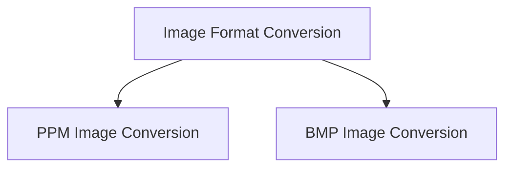

# Image Format Conversion Module

## Introduction
The `image_format_conversion` module is responsible for converting raw image data into various standard image file formats. This module provides utilities for saving 8-bit image buffers into common formats such as Portable Pixmap (PPM) and Bitmap (BMP), facilitating output and storage of processed images.

## Architecture Overview
The module is structured into specialized sub-modules, each dedicated to handling a specific image format conversion process. This design ensures modularity and ease of extension for supporting new formats.

<!-- DIAGRAM_JSON
{
    "direction": "TD",
    "nodes": [
        {"id": "ppm_conversion", "label": "PPM Image Conversion", "type": "module", "link": "ppm_conversion.md"},
        {"id": "bmp_conversion", "label": "BMP Image Conversion", "type": "module", "link": "bmp_conversion.md"}
    ],
    "edges": [
        {"source": "image_format_conversion", "target": "ppm_conversion"},
        {"source": "image_format_conversion", "target": "bmp_conversion"}
    ],
    "groups": []
}
-->

## Sub-modules

### [PPM Image Conversion](ppm_conversion.md)
This sub-module focuses on writing image data to the Portable Pixmap (PPM) file format. It includes functionality to construct the PPM header and write pixel data in the correct binary format.

### [BMP Image Conversion](bmp_conversion.md)
This sub-module handles the conversion and saving of image data into the Bitmap (BMP) file format. It manages the creation of the BMP file header, information header, and careful writing of pixel data, including handling padding and byte order conventions specific to BMP.

## Introduction and Purpose
The `image_format_conversion` module is a crucial component within the `clip_image_basic_ops` family, specifically designed to handle the manipulation and conversion of image data formats internally. Its primary purpose is to facilitate seamless transitions between different image representations, such as raw pixel data to structured image objects, and conversions between floating-point and unsigned 8-bit integer pixel formats. This ensures compatibility and efficient processing across various stages of image analysis and model inference within the CLIP (Contrastive Language-Image Pre-training) image processing pipeline.

## Architecture Overview
The `image_format_conversion` module is a focused collection of utilities. It primarily interacts with other components in the `clip_image_processing` module, particularly those that require images to be in specific formats or need to build image structures from fundamental pixel arrays. The module itself is composed of a single sub-module: `image_conversion_utilities`.

<!-- DIAGRAM_JSON
{
    "direction": "TD",
    "nodes": [
        {"id": "image_conversion_utilities", "label": "Image Conversion Utilities", "type": "module", "link": "image_conversion_utilities.md"}
    ],
    "edges": [],
    "groups": []
}
-->

## Sub-modules

### [Image Conversion Utilities](image_conversion_utilities.md)
This sub-module contains the core functions for converting between different image data types (e.g., float to u8) and for constructing image objects from raw pixel buffers. It ensures that image data is correctly formatted for downstream processing by other CLIP components.