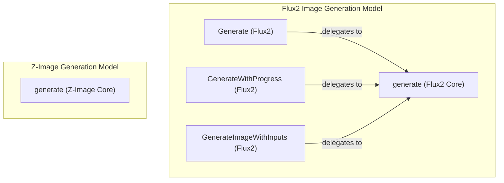

# image_generation_core
This module provides core functionalities for different image generation models, including the Flux2 and Z-Image architectures. It encapsulates the generation logic and various public interfaces for invoking image creation.

<!-- DIAGRAM_JSON
{
    "nodes": [
        {
            "id": "Flux2_Generate",
            "label": "Generate (Flux2)"
        },
        {
            "id": "Flux2_GenerateWithProgress",
            "label": "GenerateWithProgress (Flux2)"
        },
        {
            "id": "Flux2_GenerateImageWithInputs",
            "label": "GenerateImageWithInputs (Flux2)"
        },
        {
            "id": "Flux2_CoreGenerate",
            "label": "generate (Flux2 Core)"
        },
        {
            "id": "ZImage_CoreGenerate",
            "label": "generate (Z-Image Core)"
        }
    ],
    "edges": [
        {
            "source": "Flux2_Generate",
            "target": "Flux2_CoreGenerate",
            "label": "delegates to"
        },
        {
            "source": "Flux2_GenerateWithProgress",
            "target": "Flux2_CoreGenerate",
            "label": "delegates to"
        },
        {
            "source": "Flux2_GenerateImageWithInputs",
            "target": "Flux2_CoreGenerate",
            "label": "delegates to"
        }
    ],
    "groups": [
        {
            "id": "Flux2_Model",
            "label": "Flux2 Image Generation Model",
            "nodes": [
                "Flux2_Generate",
                "Flux2_GenerateWithProgress",
                "Flux2_GenerateImageWithInputs",
                "Flux2_CoreGenerate"
            ]
        },
        {
            "id": "ZImage_Model",
            "label": "Z-Image Generation Model",
            "nodes": [
                "ZImage_CoreGenerate"
            ]
        }
    ]
}
-->
