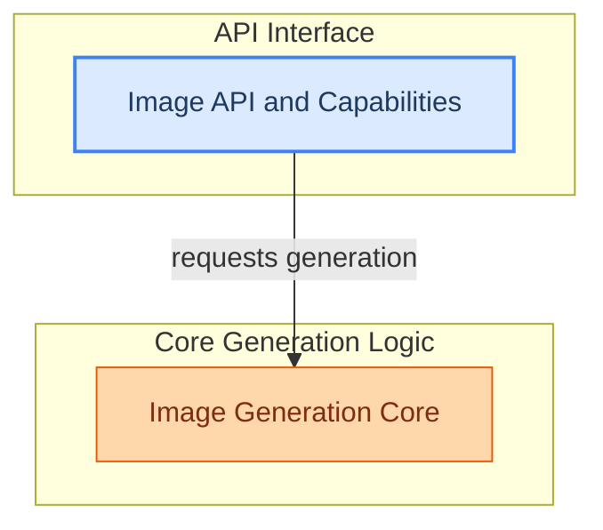

# Image Generation Subsystem
This module manages the core logic for generating images using various models like Flux2 and Z-Image, handling model capability validation and exposing image generation functionality through an API.

<!-- DIAGRAM_JSON
{
    "direction": "TD",
    "nodes": [
        {"id": "image_api_and_capabilities", "label": "Image API and Capabilities", "type": "module", "link": "image_api_and_capabilities.md"},
        {"id": "image_generation_core", "label": "Image Generation Core", "type": "module", "link": "image_generation_core.md"}
    ],
    "edges": [
        {"source": "image_api_and_capabilities", "target": "image_generation_core", "label": "requests generation"}
    ],
    "groups": [
        {"id": "api_interface", "label": "API Interface", "role": "surface", "nodes": ["image_api_and_capabilities"]},
        {"id": "core_logic", "label": "Core Generation Logic", "role": "generative", "nodes": ["image_generation_core"]}
    ]
}
-->

