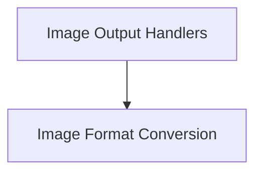

# Image Output Handlers Module

## Introduction and Purpose

The `image_output_handlers` module is responsible for managing the output of image data to various file formats. It provides core functionality for converting internal image representations into standardized formats like PPM and BMP, facilitating persistence and interoperability with other systems or viewing tools.

## Architecture Overview

The module is structured around specialized handlers for different image formats. The primary sub-module focuses on the conversion and saving of image data.

<!-- DIAGRAM_JSON
{
    "direction": "TD",
    "nodes": [
        {"id": "image_format_conversion", "label": "Image Format Conversion", "type": "module", "link": "image_format_conversion.md"}
    ],
    "edges": [],
    "groups": []
}
-->

## High-Level Functionality

- **[Image Format Conversion](image_format_conversion.md)**: This sub-module contains the logic for converting raw image buffer data into specific image file formats (e.g., PPM, BMP) and saving them to disk. It encapsulates the details of file header generation and pixel data arrangement for each format.
