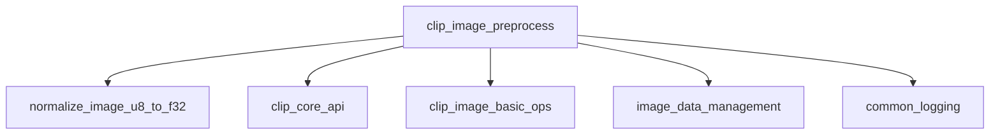

# Module: image_preprocessing

## Introduction
The `image_preprocessing` module, located within `llama_cpp_mtmd_clip.clip_image_processing.clip_image_basic_ops`, is responsible for preparing raw image data for various CLIP-based multimodal models. Its primary function is to transform 8-bit unsigned integer images (`clip_image_u8`) into a batch of 32-bit floating-point images (`clip_image_f32_batch`), applying model-specific resizing, cropping, padding, and normalization techniques based on the projector type.

## Architecture and Component Relationships

The core of this module is the `clip_image_preprocess` function. This function acts as a dispatcher, selecting the appropriate image preprocessing pipeline based on the `PROJECTOR_TYPE` defined in the `clip_ctx`. This allows for flexible and efficient handling of diverse visual input requirements across different multimodal models like MiniCPM-V, Qwen, Idefics3, GLM, LLaVA, and others.

The preprocessing steps generally involve:
1.  **Image Sizing and Transformation**: Depending on the projector, images may be resized, aspect-ratio-preserved, padded to a square, or sliced into multiple sub-images (e.g., for "anyres" processing).
2.  **Normalization**: After any sizing and transformation, the image pixel values are normalized using the model's specified `image_mean` and `image_std` parameters.

### `clip_image_preprocess` Function Details

The `clip_image_preprocess` function orchestrates the entire image preparation workflow. It takes an input `clip_image_u8` image and a `clip_ctx` (CLIP context) which contains the model's hyperparameters and the projector type. Based on the projector type, it invokes a specific sequence of operations:

*   **Slicing-based Projectors (e.g., MINICPMV, IDEFICS3, LLAMA4, LLaVA 1.6 "anyres")**: These projectors often require dividing the original image into multiple slices or tiles. The module leverages utility functions from [image_data_management](image_data_management.md) (e.g., `llava_uhd::get_slice_instructions`, `llava_uhd::slice_image`) to determine the slicing strategy and perform the actual image division. Each resulting slice is then normalized.
*   **Resizing/Padding-based Projectors (e.g., QWEN2VL, GLM4V, PIXTRAL, LFM2, JANUS_PRO)**: For these types, the module first calculates a target size, often preserving the aspect ratio or padding to a square. Functions from [clip_image_basic_ops](clip_image_basic_ops.md) (e.g., `img_tool::calc_size_preserved_ratio`, `img_tool::resize`) are used for these geometric transformations. Padding with specific colors (e.g., gray for Janus Pro, or mean RGB for LLaVA 1.5) is applied where necessary. The single resulting image is then normalized.
*   **Fixed-size Resizing Projectors (e.g., GLM_EDGE, GEMMA3)**: These projectors simply resize the image to a fixed square dimension (`params.image_size`) using bilinear interpolation, followed by normalization.

All paths converge to the `normalize_image_u8_to_f32` function, which converts the 8-bit unsigned integer pixel values to 32-bit floating-point values and applies the mean/standard deviation normalization. The final processed images are stored in a `clip_image_f32_batch` structure.

## How the Module Fits into the Overall System

The `image_preprocessing` module is a critical component within the `llama_cpp_mtmd_clip` ecosystem, specifically nested under `clip_image_processing` and `clip_image_basic_ops`. It serves as the initial gateway for visual data into multimodal models.

Its integration points are:
*   **Input**: It receives raw image data (`clip_image_u8`) and configuration (`clip_ctx`) from higher-level modules within `llama_cpp_mtmd_clip`, likely orchestrated by the [clip_core_api](clip_core_api.md) when handling image inputs for a CLIP model.
*   **Output**: It produces a batch of normalized floating-point images (`clip_image_f32_batch`) which are then consumed by subsequent stages of the CLIP model pipeline, typically for feature extraction or encoding within the `llama_cpp_mtmd_clip` module.

By abstracting the complexities of image transformations, this module ensures that diverse multimodal models can seamlessly consume visual input, regardless of their specific preprocessing requirements, promoting modularity and maintainability within the larger `llama.cpp` project.

<!-- DIAGRAM_JSON
{
    "direction": "TD",
    "nodes": [
        {"id": "clip_image_preprocess", "label": "clip_image_preprocess", "type": "component", "link": null},
        {"id": "normalize_image_u8_to_f32", "label": "normalize_image_u8_to_f32", "type": "component", "link": null},
        {"id": "clip_core_api", "label": "clip_core_api", "type": "external", "link": "clip_core_api.md"},
        {"id": "clip_image_basic_ops", "label": "clip_image_basic_ops", "type": "external", "link": "clip_image_basic_ops.md"},
        {"id": "image_data_management", "label": "image_data_management", "type": "external", "link": "image_data_management.md"},
        {"id": "common_logging", "label": "common_logging", "type": "external", "link": "common_logging.md"}
    ],
    "edges": [
        {"source": "clip_image_preprocess", "target": "normalize_image_u8_to_f32"},
        {"source": "clip_image_preprocess", "target": "clip_core_api"},
        {"source": "clip_image_preprocess", "target": "clip_image_basic_ops"},
        {"source": "clip_image_preprocess", "target": "image_data_management"},
        {"source": "clip_image_preprocess", "target": "common_logging"}
    ],
    "groups": []
}
-->
