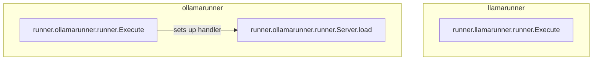

# inference_server_backends
This module implements inference server backends for Llama and Ollama models. It defines the main execution functions for each runner and a specific HTTP handler for loading models.

<!-- DIAGRAM_JSON
{
  "nodes": [
    {
      "id": "llamarunner_execute",
      "label": "runner.llamarunner.runner.Execute"
    },
    {
      "id": "ollamarunner_execute",
      "label": "runner.ollamarunner.runner.Execute"
    },
    {
      "id": "ollamarunner_server_load",
      "label": "runner.ollamarunner.runner.Server.load"
    }
  ],
  "edges": [
    {
      "source": "ollamarunner_execute",
      "target": "ollamarunner_server_load",
      "label": "sets up handler"
    }
  ],
  "groups": [
    {
      "id": "llamarunner",
      "label": "llamarunner",
      "nodes": ["llamarunner_execute"]
    },
    {
      "id": "ollamarunner",
      "label": "ollamarunner",
      "nodes": ["ollamarunner_execute", "ollamarunner_server_load"]
    }
  ]
}
-->
