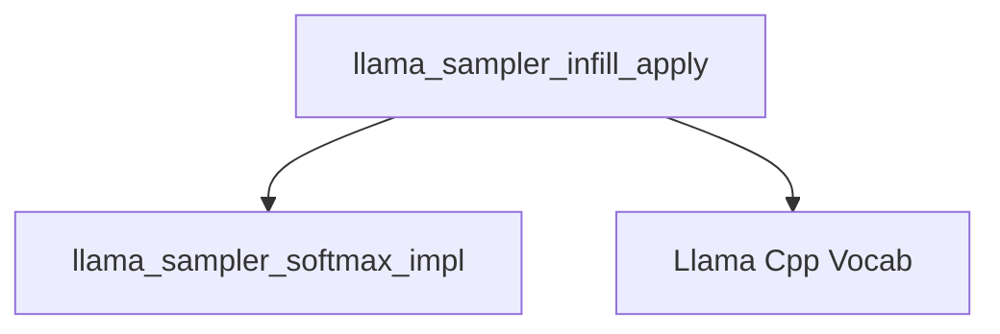

# Infill Sampling Module

## Introduction

The `infill_sampling` module, a sub-module of `llama_cpp_sampling`, is responsible for implementing the infill sampling logic within the Llama C++ binding. This module is crucial for tasks such as code completion or text insertion, where the model needs to generate text to fill in a missing section. It intelligently adjusts token probabilities, prioritizes "End Of Generation" (EOG) tokens when appropriate, and merges prefix-sharing tokens to ensure coherent and contextually relevant infill generation.

## Architecture and Component Relationships

This module's core functionality revolves around the `llama_sampler_infill_apply` function, which orchestrates the infill sampling process. It interacts with the `llama_cpp_sampling` module for fundamental sampling operations and relies on the `llama_cpp_vocab` module for token-specific information and transformations.

<!-- DIAGRAM_JSON
{
    "direction": "TD",
    "nodes": [
        {"id": "llama_sampler_infill_apply", "label": "llama_sampler_infill_apply", "type": "component", "link": null},
        {"id": "llama_sampler_softmax_impl", "label": "llama_sampler_softmax_impl", "type": "external", "link": "llama_cpp_sampling.md"},
        {"id": "llama_cpp_vocab", "label": "Llama Cpp Vocab", "type": "external", "link": "llama_cpp_vocab.md"}
    ],
    "edges": [
        {"source": "llama_sampler_infill_apply", "target": "llama_sampler_softmax_impl"},
        {"source": "llama_sampler_infill_apply", "target": "llama_cpp_vocab"}
    ],
    "groups": []
}
-->

## Core Functionality

The `llama_sampler_infill_apply` function performs the following key steps:

1.  **Softmax Application**: Applies a softmax function to the raw logits of the current token candidates (`llama_token_data_array`) to convert them into probabilities. This step is delegated to `llama_sampler_softmax_impl`.

2.  **EOG/Text Token Categorization**: It calculates the sum of probabilities for "End Of Generation" (EOG) tokens and regular text tokens. EOG tokens are identified using the `is_eog` function from the vocabulary module.

3.  **EOG Prioritization**: If the ratio of text token probabilities to EOG token probabilities is too low (indicating a strong signal to end generation), the sampler prunes all non-EOG tokens, normalizing the probabilities only among the remaining EOG tokens. This effectively biases the sampling towards ending the infill.

4.  **Token Prefix Combination**: It iterates through the token candidates and combines the probabilities of tokens that are prefixes of other tokens. This helps in reducing redundancy and biases sampling towards longer, more complete tokens when a shorter prefix is also a valid token. This involves using `token_to_piece` from the vocabulary module to get token representations.

5.  **Probability Thresholding**: The module applies two stages of probability thresholding:
    *   Initially, tokens with probabilities below `0.2f` (and not EOG tokens) are discarded.
    *   After re-normalizing, a second, dynamic threshold of `1.0 / (n_non_eog + 1)` is applied to further refine the token set, again normalizing probabilities among the remaining tokens.

6.  **Edge Case Handling**: If, after all filtering, no non-EOG tokens remain, the `cur_p` array is reduced to a single End Of Text (EOT) or End Of Stream (EOS) token to ensure a valid completion.

## Module Integration

The `infill_sampling` module is an integral part of the `llama_cpp_sampling` system, providing specialized token probability manipulation for infill generation tasks. It works in conjunction with other sampling techniques to guide the model's output. Its dependency on `llama_cpp_vocab` highlights the importance of a well-defined vocabulary for managing special tokens and token-to-piece conversions, which are fundamental to the infill logic.
