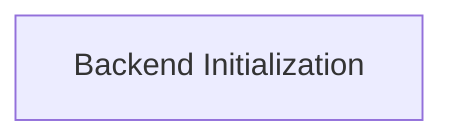

# Initialization and Setup Module

This module is responsible for the core initialization and setup procedures for the `ggml-metal` backend. It provides the foundational functions to initialize the Metal backend and specific Metal devices, ensuring the `ggml` framework can leverage Apple's Metal API for accelerated computations.

## Architecture Overview

The `initialization_and_setup` module acts as the entry point for configuring the `ggml-metal` backend. It interacts with the broader `ggml_backend_metal` module to register and initialize Metal devices. The `backend_initialization` sub-module encapsulates the logic for obtaining a Metal context and setting up the backend structure, forming a critical part of the Metal backend's lifecycle.

<!-- DIAGRAM_JSON
{
    "direction": "TD",
    "nodes": [
        {"id": "backend_initialization", "label": "Backend Initialization", "type": "module", "link": "backend_initialization.md"}
    ],
    "edges": []
}
-->

## Sub-modules

### [Backend Initialization](backend_initialization.md)

This sub-module handles the initialization of the `ggml` Metal backend, including context allocation and the overall backend structure setup. It provides the essential functions for integrating `ggml` with Metal devices.