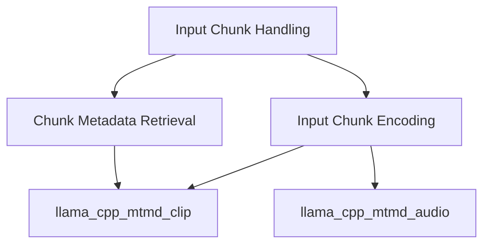

# Input Chunk Handling Module

The `input_chunk_handling` module is responsible for managing and processing various types of input data chunks, including text, images, and audio, before they are fed into a language model. It provides core functionalities for encoding these diverse inputs into a unified representation and for retrieving essential metadata about each chunk. This module acts as a crucial interface between raw multimodal inputs and the model's processing pipeline, ensuring proper data preparation and handling.

## Architecture Overview

The `input_chunk_handling` module is structured into distinct sub-modules to manage the specific functionalities of input chunk processing and metadata retrieval. It primarily interacts with multimedia processing modules like `llama_cpp_mtmd_clip` for image data and `llama_cpp_mtmd_audio` for audio data to handle complex encoding tasks. Text chunks are managed directly for basic information.

<!-- DIAGRAM_JSON
{
    "direction": "TD",
    "nodes": [
        {"id": "input_chunk_handling", "label": "Input Chunk Handling", "type": "module"},
        {"id": "chunk_encoding", "label": "Input Chunk Encoding", "type": "module", "link": "chunk_encoding.md"},
        {"id": "chunk_metadata", "label": "Chunk Metadata Retrieval", "type": "module", "link": "chunk_metadata.md"},
        {"id": "llama_cpp_mtmd_clip", "label": "CLIP Multimodal Processing", "type": "external", "link": "llama_cpp_mtmd_clip.md"},
        {"id": "llama_cpp_mtmd_audio", "label": "Audio Multimodal Processing", "type": "external", "link": "llama_cpp_mtmd_audio.md"}
    ],
    "edges": [
        {"source": "input_chunk_handling", "target": "chunk_encoding"},
        {"source": "input_chunk_handling", "target": "chunk_metadata"},
        {"source": "chunk_encoding", "target": "llama_cpp_mtmd_clip"},
        {"source": "chunk_encoding", "target": "llama_cpp_mtmd_audio"},
        {"source": "chunk_metadata", "target": "llama_cpp_mtmd_clip"}
    ],
    "groups": []
}
-->

## Sub-modules

*   ### [Input Chunk Encoding](chunk_encoding.md)
    This sub-module focuses on the `mtmd_encode_chunk` function, which is responsible for transforming various input chunk types (text, image, audio) into a format suitable for the multimodal model. It delegates image processing to the vision context and audio processing to the audio context, leveraging specialized encoding functions.

*   ### [Chunk Metadata Retrieval](chunk_metadata.md)
    This sub-module, encompassing `mtmd_input_chunk_get_n_tokens` and `mtmd_input_chunk_get_n_pos`, provides utilities to extract critical metadata from input chunks. It allows for querying the number of tokens and positions for text, image, and audio inputs, ensuring accurate contextual information for downstream model operations.
