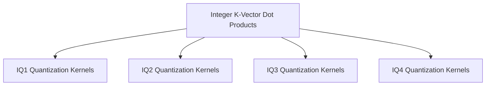

# Integer K-Vector Dot Products

## Introduction

The `integer_k_vec_dots` module provides highly optimized implementations of vector dot products for various integer quantization (IQ) types on ARM architecture. These functions are crucial for efficient computation in machine learning models, particularly those leveraging quantized neural networks to reduce memory footprint and computational cost.

This module is a part of the `arm_vec_dot_k_quants` module, which specializes in ARM-specific quantized vector dot product operations within the `ggml-cpu` backend. It focuses on different integer quantization schemes, including IQ1, IQ2, IQ3, and IQ4, each optimized for specific precision and performance characteristics.

## Architecture

The `integer_k_vec_dots` module is structured into several sub-modules, each dedicated to a specific integer quantization type. This organization allows for clear separation of concerns and facilitates the development and maintenance of highly specialized and optimized kernels.

<!-- DIAGRAM_JSON
{
    "direction": "TD",
    "nodes": [
        {"id": "iq1_quantization_kernels", "label": "IQ1 Quantization Kernels", "type": "module", "link": "iq1_quantization_kernels.md"},
        {"id": "iq2_quantization_kernels", "label": "IQ2 Quantization Kernels", "type": "module", "link": "iq2_quantization_kernels.md"},
        {"id": "iq3_quantization_kernels", "label": "IQ3 Quantization Kernels", "type": "module", "link": "iq3_quantization_kernels.md"},
        {"id": "iq4_quantization_kernels", "label": "IQ4 Quantization Kernels", "type": "module", "link": "iq4_quantization_kernels.md"}
    ],
    "edges": [
        {"source": "integer_k_vec_dots", "target": "iq1_quantization_kernels"},
        {"source": "integer_k_vec_dots", "target": "iq2_quantization_kernels"},
        {"source": "integer_k_vec_dots", "target": "iq3_quantization_kernels"},
        {"source": "integer_k_vec_dots", "target": "iq4_quantization_kernels"}
    ],
    "groups": []
}
-->

## Sub-modules

This module is comprised of the following sub-modules, each handling specific integer quantization types:

*   **[IQ1 Quantization Kernels](iq1_quantization_kernels.md)**: This sub-module contains implementations for IQ1 integer quantization, providing functions like `ggml_vec_dot_iq1_m_q8_K` and `ggml_vec_dot_iq1_s_q8_K` for different scales.

*   **[IQ2 Quantization Kernels](iq2_quantization_kernels.md)**: This sub-module focuses on IQ2 integer quantization with functions such as `ggml_vec_dot_iq2_xs_q8_K`, `ggml_vec_dot_iq2_s_q8_K`, and `ggml_vec_dot_iq2_xxs_q8_K` for various extra-small and small scales.

*   **[IQ3 Quantization Kernels](iq3_quantization_kernels.md)**: This sub-module includes optimized vector dot product routines for IQ3 integer quantization, specifically `ggml_vec_dot_iq3_s_q8_K` and `ggml_vec_dot_iq3_xxs_q8_K` for small and extra-extra-small scales.

*   **[IQ4 Quantization Kernels](iq4_quantization_kernels.md)**: This sub-module provides a vector dot product implementation for IQ4 integer quantization with extra-small scales through the `ggml_vec_dot_iq4_xs_q8_K` function.