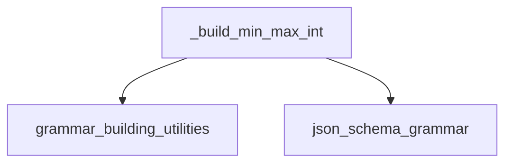

# integer_range_grammar

## Introduction
The `integer_range_grammar` module is a specialized component within the `json_schema_grammar` and `grammar_building_utilities` sub-system of `llama_cpp_common`. Its primary function is to generate grammar rules for integer ranges, enabling precise control over integer value generation within a larger grammar-based system. This module is crucial for ensuring that generated integer values adhere to specified minimum and maximum constraints, as defined in JSON schemas.

## Architecture and Component Relationships

The `integer_range_grammar` module currently contains one core component: `_build_min_max_int`. This function is responsible for recursively constructing the grammar string that represents a given integer range.

<!-- DIAGRAM_JSON
{
    "direction": "TD",
    "nodes": [
        {"id": "_build_min_max_int", "label": "_build_min_max_int", "type": "component", "link": null},
        {"id": "grammar_building_utilities", "label": "grammar_building_utilities", "type": "external", "link": "grammar_building_utilities.md"},
        {"id": "json_schema_grammar", "label": "json_schema_grammar", "type": "external", "link": "json_schema_grammar.md"}
    ],
    "edges": [
        {"source": "_build_min_max_int", "target": "grammar_building_utilities"},
        {"source": "_build_min_max_int", "target": "json_schema_grammar"}
    ],
    "groups": []
}
-->

## How the module fits into the overall system

This module is a leaf component in the grammar generation hierarchy. It is specifically called by the higher-level `json_schema_grammar` module (likely through `grammar_building_utilities`) to translate integer constraints found in JSON schemas into a machine-readable grammar format. This grammar is then used by the `llama_cpp_grammar` module for controlled text generation, ensuring that numerical outputs conform to defined schema rules.

## Core Components

### `_build_min_max_int`

This static C++ function generates a grammar string representing an integer range defined by `min_value` and `max_value`. It handles both positive and negative ranges, as well as cases where only a minimum or maximum is specified. The function uses a recursive approach to build the grammar, breaking down large ranges into smaller, manageable parts.

**Parameters:**
*   `min_value` (int64_t): The minimum allowed integer value.
*   `max_value` (int64_t): The maximum allowed integer value.
*   `out` (std::stringstream &): An output stream to which the generated grammar string is appended.
*   `decimals_left` (int): (Optional) Internal parameter for recursive calls, tracking remaining decimal places to consider. Default is 16.
*   `top_level` (bool): (Optional) Internal parameter, indicating if the current call is the initial one or a recursive sub-call. Default is true.

**Key Functionality:**
*   **Range Handling:** Manages various scenarios including negative ranges, ranges spanning zero, and open-ended ranges (only min or max specified).
*   **Recursive Grammar Generation:** Breaks down complex ranges into simpler sub-problems, generating grammar for prefixes and subsequent digits.
*   **Helper Lambdas:** Utilizes `digit_range` and `more_digits` to construct character ranges and digit repetitions efficiently.
*   **Dependency on `string_repeat`:** Relies on the `string_repeat` utility (likely from the [grammar_building_utilities](grammar_building_utilities.md) module) for generating repeated character strings (e.g., "000", "999").

**Example of Generated Grammar (conceptual):**
For `min_value = 10`, `max_value = 25`:
The function would generate a grammar resembling `("1" [0-9]) | ("2" [0-5])` or similar, allowing numbers from 10 to 25.

**Error Handling:**
Throws `std::runtime_error` if neither `min_value` nor `max_value` is set (i.e., both are at their `numeric_limits` default indicating no constraint).
