# integration_launch_flows
This module contains 38 components, including these 10 test functions, which validate various aspects of the launch and model selection flows.

<!-- DIAGRAM_JSON
{
  "nodes": [
    {"id": "T1", "label": "TestLaunchCmdYes_AutoConfirmsLaunchPromptPath"},
    {"id": "T2", "label": "TestLaunchCmdHeadlessWithYes_AutoPullsMissingLocalModel"},
    {"id": "T3", "label": "TestLaunchCmdHeadlessYes_IntegrationRequiresModelEvenWhenSaved"},
    {"id": "T4", "label": "TestLaunchCmdModelFlagClearsDisabledCloudOverride"},
    {"id": "T5", "label": "TestLaunchCmdModelFlagFiltersDisabledCloudFromSavedConfig"},
    {"id": "T6", "label": "TestLaunchCmdIntegrationArgPromptsForModelWithSavedSelection"},
    {"id": "T7", "label": "TestShowOrPullWithPolicy_CloudModelNotFound_FailsEarlyForAllPolicies"},
    {"id": "T8", "label": "TestLaunchIntegration_EditorConfigureMultiSkipsMissingLocalAndPersistsAccepted"},
    {"id": "T9", "label": "TestLaunchIntegration_EditorConfigureMultiSkipsUnauthedCloudAndPersistsAccepted"},
    {"id": "T10", "label": "TestLaunchIntegration_EditorConfigureMultiRemovesReselectedFailingModel"},
    {"id": "F1", "label": "LaunchCmd", "type": "function"},
    {"id": "F2", "label": "showOrPullWithPolicy", "type": "function"},
    {"id": "F3", "label": "LaunchIntegration", "type": "function"}
  ],
  "edges": [
    {"source": "T1", "target": "F1"},
    {"source": "T2", "target": "F1"},
    {"source": "T3", "target": "F1"},
    {"source": "T4", "target": "F1"},
    {"source": "T5", "target": "F1"},
    {"source": "T6", "target": "F1"},
    {"source": "T7", "target": "F2"},
    {"source": "T8", "target": "F3"},
    {"source": "T9", "target": "F3"},
    {"source": "T10", "target": "F3"}
  ],
  "groups": [
    {"id": "G1", "label": "cmd.launch.command_test", "nodes": ["T1", "T2", "T3", "T4", "T5", "T6"]},
    {"id": "G2", "label": "cmd.launch.integrations_test", "nodes": ["T7"]},
    {"id": "G3", "label": "cmd.launch.launch_test", "nodes": ["T8", "T9", "T10"]}
  ]
}
-->

```mermaid
flowchart TD
    subgraph cmd.launch.command_test
        T1[TestLaunchCmdYes_AutoConfirmsLaunchPromptPath]
        T2[TestLaunchCmdHeadlessWithYes_AutoPullsMissingLocalModel]
        T3[TestLaunchCmdHeadlessYes_IntegrationRequiresModelEvenWhenSaved]
        T4[TestLaunchCmdModelFlagClearsDisabledCloudOverride]
        T5[TestLaunchCmdModelFlagFiltersDisabledCloudFromSavedConfig]
        T6[TestLaunchCmdIntegrationArgPromptsForModelWithSavedSelection]
    end
    subgraph cmd.launch.integrations_test
        T7[TestShowOrPullWithPolicy_CloudModelNotFound_FailsEarlyForAllPolicies]
    end
    subgraph cmd.launch.launch_test
        T8[TestLaunchIntegration_EditorConfigureMultiSkipsMissingLocalAndPersistsAccepted]
        T9[TestLaunchIntegration_EditorConfigureMultiSkipsUnauthedCloudAndPersistsAccepted]
        T10[TestLaunchIntegration_EditorConfigureMultiRemovesReselectedFailingModel]
    end

    F1((LaunchCmd))
    F2((showOrPullWithPolicy))
    F3((LaunchIntegration))

    T1 --> F1
    T2 --> F1
    T3 --> F1
    T4 --> F1
    T5 --> F1
    T6 --> F1
    T7 --> F2
    T8 --> F3
    T9 --> F3
    T10 --> F3
```
