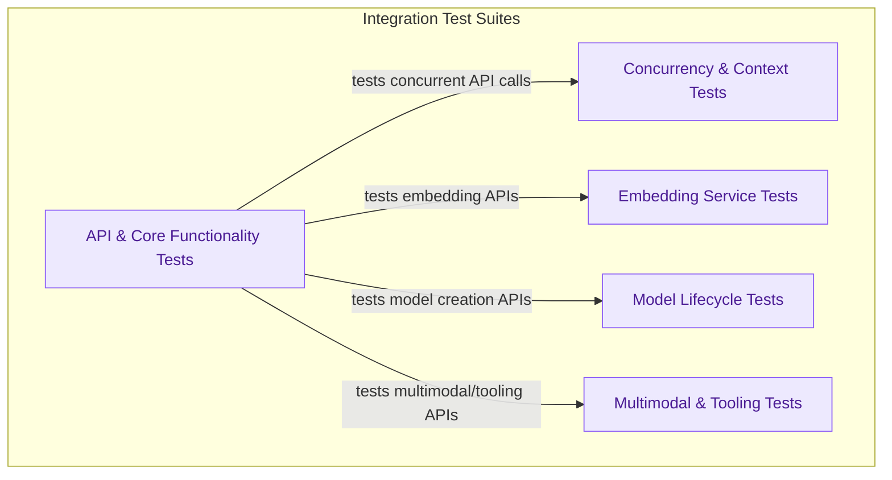

# Integration Testing
This module provides a comprehensive suite of integration tests, ensuring the robust functionality and performance of various core API endpoints, model lifecycle management, concurrency, multimodal capabilities, and advanced model features like embeddings and tool calling.

<!-- DIAGRAM_JSON
{
    "direction": "TD",
    "nodes": [
        {
            "id": "api_core",
            "label": "API & Core Functionality Tests",
            "type": "module",
            "link": "api_and_core_tests.md"
        },
        {
            "id": "concurrency_context",
            "label": "Concurrency & Context Tests",
            "type": "module",
            "link": "concurrency_and_context_tests.md"
        },
        {
            "id": "embedding_service",
            "label": "Embedding Service Tests",
            "type": "module",
            "link": "embedding_service_tests.md"
        },
        {
            "id": "model_lifecycle",
            "label": "Model Lifecycle Tests",
            "type": "module",
            "link": "model_lifecycle_tests.md"
        },
        {
            "id": "multimodal_tooling",
            "label": "Multimodal & Tooling Tests",
            "type": "module",
            "link": "multimodal_and_tooling_tests.md"
        }
    ],
    "edges": [
        {
            "source": "api_core",
            "target": "concurrency_context",
            "label": "tests concurrent API calls"
        },
        {
            "source": "api_core",
            "target": "embedding_service",
            "label": "tests embedding APIs"
        },
        {
            "source": "api_core",
            "target": "model_lifecycle",
            "label": "tests model creation APIs"
        },
        {
            "source": "api_core",
            "target": "multimodal_tooling",
            "label": "tests multimodal/tooling APIs"
        }
    ],
    "groups": [
        {
            "id": "test_suites",
            "label": "Integration Test Suites",
            "role": "analytical",
            "nodes": [
                "api_core",
                "concurrency_context",
                "embedding_service",
                "model_lifecycle",
                "multimodal_tooling"
            ]
        }
    ]
}
-->
