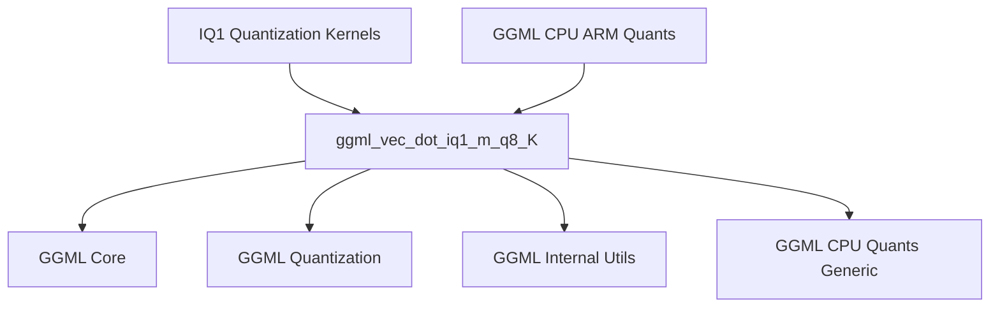

# iq1_m_kernel Module Documentation

## Introduction

The `iq1_m_kernel` module is a low-level, highly optimized component within the GGML (Georgi Gerganov Machine Learning) library, specifically designed for efficient execution on ARM architectures. Its primary function is to perform vector dot products between `IQ1_M` (1-bit integer with medium quantization) and `Q8_K` (8-bit integer with K-quantization) quantized data formats. This module is a leaf component within the `ggml_cpu_arm_quants` family, providing a crucial performance primitive for quantized large language models (LLMs) on ARM-based systems.

## Comprehensive Documentation

### Purpose and Core Functionality

The `iq1_m_kernel` module encapsulates the `ggml_vec_dot_iq1_m_q8_K` function, which is an ARM NEON-optimized implementation of a vector dot product. This function is vital for accelerating the inference of machine learning models that utilize specific 1-bit and 8-bit quantization schemes. By leveraging ARM NEON intrinsics, it significantly speeds up a fundamental operation in neural networks, contributing to overall model efficiency and reduced computational overhead on ARM processors.

The `ggml_vec_dot_iq1_m_q8_K` function takes quantized input vectors (`vx` of type `block_iq1_m` and `vy` of type `block_q8_K`) and computes their dot product, storing the result in a float pointer `s`. It handles the unpacking, scaling, and accumulation of quantized values, specifically targeting the characteristics of `IQ1_M` and `Q8_K` formats. In scenarios where ARM NEON is not available, a generic C implementation `ggml_vec_dot_iq1_m_q8_K_generic` is used as a fallback.

### Architecture and Component Relationships

The `iq1_m_kernel` module's architecture is centered around its single core component, `ggml_vec_dot_iq1_m_q8_K`. This function acts as a specialized computational kernel.

<!-- DIAGRAM_JSON
{
    "direction": "TD",
    "nodes": [
        {"id": "ggml_vec_dot_iq1_m_q8_K", "label": "ggml_vec_dot_iq1_m_q8_K", "type": "component", "link": null},
        {"id": "iq1_quantization_kernels", "label": "IQ1 Quantization Kernels", "type": "external", "link": "iq1_quantization_kernels.md"},
        {"id": "ggml_cpu_arm_quants", "label": "GGML CPU ARM Quants", "type": "external", "link": "ggml_cpu_arm_quants.md"},
        {"id": "ggml_core", "label": "GGML Core", "type": "external", "link": "ggml_core.md"},
        {"id": "ggml_quantization", "label": "GGML Quantization", "type": "external", "link": "ggml_quantization.md"},
        {"id": "ggml_internal_utils", "label": "GGML Internal Utils", "type": "external", "link": "ggml_internal_utils.md"},
        {"id": "ggml_cpu_quants_generic", "label": "GGML CPU Quants Generic", "type": "external", "link": "ggml_cpu_quants_generic.md"}
    ],
    "edges": [
        {"source": "iq1_quantization_kernels", "target": "ggml_vec_dot_iq1_m_q8_K"},
        {"source": "ggml_cpu_arm_quants", "target": "ggml_vec_dot_iq1_m_q8_K"},
        {"source": "ggml_vec_dot_iq1_m_q8_K", "target": "ggml_core"},
        {"source": "ggml_vec_dot_iq1_m_q8_K", "target": "ggml_quantization"},
        {"source": "ggml_vec_dot_iq1_m_q8_K", "target": "ggml_internal_utils"},
        {"source": "ggml_vec_dot_iq1_m_q8_K", "target": "ggml_cpu_quants_generic"}
    ],
    "groups": []
}
-->

*Diagram: `iq1_m_kernel` Module Architecture*

**Internal Components:**
-   `ggml_vec_dot_iq1_m_q8_K`: The core function responsible for the ARM NEON optimized IQ1_M and Q8_K quantized vector dot product.

**External Dependencies:**
-   **[iq1_quantization_kernels](iq1_quantization_kernels.md)**: This module is a sub-module of `iq1_quantization_kernels`, meaning it contributes a specific kernel implementation to that broader quantization strategy.
-   **[ggml_cpu_arm_quants](ggml_cpu_arm_quants.md)**: As part of the ARM-specific quantization routines, this module is directly utilized by or integrated into the `ggml_cpu_arm_quants` component.
-   **[ggml_core](ggml_core.md)**: Provides fundamental GGML definitions, types, and utility macros (e.g., `QK_K`, `GGML_RESTRICT`).
-   **[ggml_quantization](ggml_quantization.md)**: Likely defines the structures for quantized blocks (`block_iq1_m`, `block_q8_K`) and related quantization constants or lookup tables (`iq1s_grid`, `iq1m_scale_t`).
-   **[ggml_internal_utils](ggml_internal_utils.md)**: Supplies general utility macros such as `UNUSED` and `GGML_CPU_FP16_TO_FP32`.
-   **[ggml_cpu_quants_generic](ggml_cpu_quants_generic.md)**: Contains the generic C implementation of quantization functions, which `ggml_vec_dot_iq1_m_q8_K` falls back to if ARM NEON optimizations are not available.

### How the Module Fits into the Overall System

The `iq1_m_kernel` module is a specialized, low-level optimization for ARM CPUs within the GGML ecosystem. It sits deep within the `ggml_cpu_arm_quants` hierarchy, providing a highly performant kernel for a specific combination of quantization types. Its role is to execute the most computationally intensive parts of quantized model inference as quickly as possible on ARM hardware.

This module is part of the larger `llama_cpp` framework, which leverages GGML for efficient execution of large language models. By providing an optimized dot product for `IQ1_M` and `Q8_K` data, it directly contributes to the overall speed and efficiency of running quantized LLMs on ARM-based devices, such as Apple Silicon Macs, mobile phones, or embedded systems. Its existence allows for smaller model sizes and faster inference times, which are crucial for deploying LLMs in resource-constrained environments.