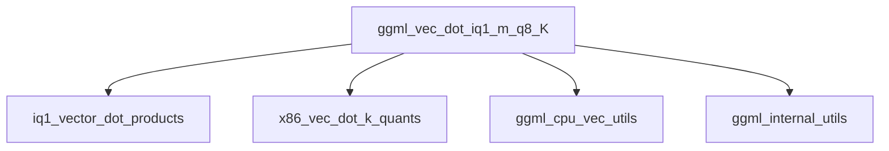

# iq1_m_vector_dot Module Documentation

## Introduction

The `iq1_m_vector_dot` module provides highly optimized vector dot product implementations specifically for the IQ1_M quantization scheme. This module is a critical component within the GGML library, focusing on accelerating operations involving 1-bit quantized data (IQ1_M) and 8-bit quantized data (Q8_K) on x86 architectures. Its primary goal is to enable efficient inference for large language models by leveraging CPU-specific intrinsic instructions like AVX2 and AVX.

## Architecture and Component Relationships

The `iq1_m_vector_dot` module is a leaf module, containing a single core function: `ggml_vec_dot_iq1_m_q8_K`. This function is responsible for computing the dot product between a vector quantized in IQ1_M format and another vector quantized in Q8_K format. The implementation is heavily optimized using x86 SIMD extensions.

### Core Functionality: `ggml_vec_dot_iq1_m_q8_K`

```c
void ggml_vec_dot_iq1_m_q8_K(int n, float * GGML_RESTRICT s, size_t bs, const void * GGML_RESTRICT vx, size_t bx, const void * GGML_RESTRICT vy, size_t by, int nrc);
```

This function performs the following steps:
1.  **Input Parameters**:
    *   `n`: The total number of elements in the vectors, which must be a multiple of `QK_K` (a block size constant).
    *   `s`: A pointer to a float where the resulting scalar dot product will be stored.
    *   `vx`: A pointer to the input vector `x`, quantized in the `block_iq1_m` format.
    *   `vy`: A pointer to the input vector `y`, quantized in the `block_q8_K` format.
    *   `bs`, `bx`, `by`, `nrc`: Additional parameters related to block sizes and counts, often asserted to specific values.
2.  **Quantization Scheme Handling**: It processes the input vectors in blocks, extracting 1-bit quantized values along with their associated scales from `block_iq1_m` and 8-bit quantized values from `block_q8_K`.
3.  **Scale Extraction**: For each block, it extracts 3-bit scales from the `IQ1_M` block, which are then prepared for SIMD operations.
4.  **SIMD Optimization**: The core computation is highly optimized using `__AVX2__` or `__AVX__` intrinsics (if available). This involves:
    *   Decoding the 1-bit `IQ1_M` values and combining them with sign information using lookup tables (e.g., `iq1s_grid`).
    *   Loading 8-bit `Q8_K` values.
    *   Performing parallel multiplications and accumulations of these quantized bytes using intrinsics like `_mm256_maddubs_epi16` or custom `mul_add_epi8` helpers.
    *   Applying the extracted scales to the intermediate products.
    *   Accumulating results in 32-bit integer accumulators (`sumi1`, `sumi2`).
5.  **Final Summation**: The accumulated integer results are converted to floating-point, scaled by the block's de-quantization scale (`y[i].d`) and the `IQ1_M` block's floating-point scale, and added to final float accumulators. A horizontal sum function (`hsum_float_8`) is used to combine the results from SIMD registers, and an `IQ1M_DELTA` term is applied to one of the sums, indicating a specific adjustment for the IQ1_M format.

## How the Module Fits into the Overall System

The `iq1_m_vector_dot` module is a low-level, performance-critical component within the [ggml_cpu_x86_quants](ggml_cpu_x86_quants.md) module hierarchy. It directly contributes to the efficient execution of quantized neural network operations on x86 CPUs. By providing an optimized dot product for IQ1_M and Q8_K quantization types, it enables GGML-based applications (like `llama_cpp`) to run inference with reduced memory footprint and improved speed, particularly for models that leverage these specific quantization schemes. It is part of the specialized kernels designed to exploit modern CPU features, significantly impacting the overall performance of quantized model inference.

<!-- DIAGRAM_JSON
{
    "direction": "TD",
    "nodes": [
        {"id": "ggml_vec_dot_iq1_m_q8_K", "label": "ggml_vec_dot_iq1_m_q8_K", "type": "component", "link": null},
        {"id": "iq1_vector_dot_products", "label": "iq1_vector_dot_products", "type": "external", "link": "iq1_vector_dot_products.md"},
        {"id": "x86_vec_dot_k_quants", "label": "x86_vec_dot_k_quants", "type": "external", "link": "x86_vec_dot_k_quants.md"},
        {"id": "ggml_cpu_vec_utils", "label": "ggml_cpu_vec_utils", "type": "external", "link": "ggml_cpu_vec_utils.md"},
        {"id": "ggml_internal_utils", "label": "ggml_internal_utils", "type": "external", "link": "ggml_internal_utils.md"}
    ],
    "edges": [
        {"source": "ggml_vec_dot_iq1_m_q8_K", "target": "iq1_vector_dot_products"},
        {"source": "ggml_vec_dot_iq1_m_q8_K", "target": "x86_vec_dot_k_quants"},
        {"source": "ggml_vec_dot_iq1_m_q8_K", "target": "ggml_cpu_vec_utils"},
        {"source": "ggml_vec_dot_iq1_m_q8_K", "target": "ggml_internal_utils"}
    ],
    "groups": []
}
-->

