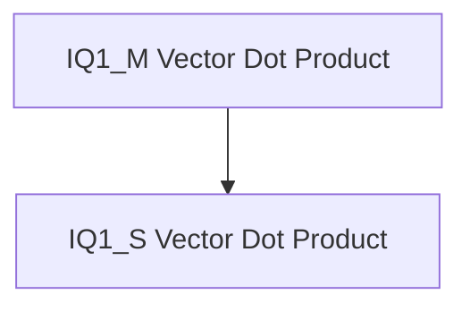

# IQ1 Quantization Kernels (ARM)

This module provides highly optimized ARM NEON kernels specifically designed for efficient vector dot product operations involving IQ1 quantized tensors and Q8_K quantized tensors. These kernels are a critical component for accelerating inference on ARM-based CPUs by leveraging low-bit quantization, contributing to reduced memory footprint and improved computational speed.

## Architecture

The `iq1_quantization_kernels` module is composed of two primary sub-modules, each implementing a specialized vector dot product kernel. These sub-modules work in tandem to handle different IQ1 quantization schemes, ensuring flexibility and optimal performance.

<!-- DIAGRAM_JSON
{
    "direction": "TD",
    "nodes": [
        {"id": "iq1_m_kernel", "label": "IQ1_M Vector Dot Product", "type": "module", "link": "iq1_m_kernel.md"},
        {"id": "iq1_s_kernel", "label": "IQ1_S Vector Dot Product", "type": "module", "link": "iq1_s_kernel.md"}
    ],
    "edges": [
        {"source": "iq1_m_kernel", "target": "iq1_s_kernel", "label": "related"}
    ],
    "groups": []
}
-->

## Sub-modules

*   ### [IQ1_M Vector Dot Product](iq1_m_kernel.md)
    This sub-module focuses on the `ggml_vec_dot_iq1_m_q8_K` function, providing an ARM NEON optimized kernel for computing vector dot products specifically for IQ1_M quantized inputs. It efficiently processes the unique encoding of IQ1_M to deliver high performance.

*   ### [IQ1_S Vector Dot Product](iq1_s_kernel.md)
    This sub-module implements the `ggml_vec_dot_iq1_s_q8_K` function, another ARM NEON optimized kernel tailored for computing vector dot products using IQ1_S quantized inputs. It handles the specific characteristics of IQ1_S quantization for optimized execution.