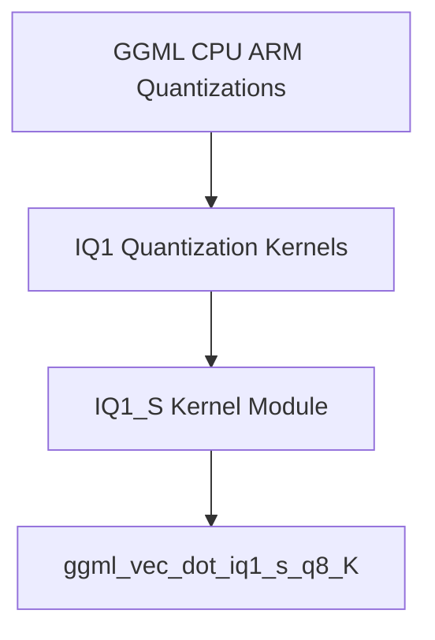

# IQ1_S Kernel Module Documentation

## Introduction

The `iq1_s_kernel` module provides highly optimized ARM NEON kernels for performing vector dot products with IQ1_S quantized data. This module is a critical component within the GGML library, specifically designed to accelerate operations involving IQ1_S and Q8_K quantization schemes on ARM-based CPUs. Its primary function is to enable efficient inference for models that utilize these specific low-bit quantization formats, contributing to faster execution and reduced memory footprint.

## Architecture and Component Relationships

The `iq1_s_kernel` module is a specialized component within the broader `ggml_cpu_arm_quants` architecture. It contains the `ggml_vec_dot_iq1_s_q8_K` function, which is the core implementation for the IQ1_S and Q8_K quantized vector dot product on ARM processors leveraging NEON intrinsics.

<!-- DIAGRAM_JSON
{
    "direction": "TD",
    "nodes": [
        {"id": "iq1_s_kernel_impl", "label": "ggml_vec_dot_iq1_s_q8_K", "type": "component", "link": null},
        {"id": "iq1_s_kernel_module", "label": "IQ1_S Kernel Module", "type": "component", "link": null},
        {"id": "iq1_quantization_kernels", "label": "IQ1 Quantization Kernels", "type": "external", "link": "iq1_quantization_kernels.md"},
        {"id": "ggml_cpu_arm_quants", "label": "GGML CPU ARM Quantizations", "type": "external", "link": "ggml_cpu_arm_quants.md"}
    ],
    "edges": [
        {"source": "iq1_s_kernel_module", "target": "iq1_s_kernel_impl"},
        {"source": "iq1_quantization_kernels", "target": "iq1_s_kernel_module"},
        {"source": "ggml_cpu_arm_quants", "target": "iq1_quantization_kernels"}
    ],
    "groups": []
}
-->

### Core Components

The primary component of this module is:

-   **`ggml_vec_dot_iq1_s_q8_K`**: This function implements the vector dot product for IQ1_S quantized input (`vx`) and Q8_K quantized input (`vy`). It is specifically optimized for ARM processors utilizing NEON intrinsics to perform efficient calculations. It iterates through blocks of quantized data, loads them into NEON registers, and computes partial dot products which are then accumulated. The function handles the scaling factors (`d`, `bsums`) associated with these quantization formats. In environments where ARM NEON is not available, it gracefully falls back to a generic implementation.

## How the Module Fits into the Overall System

The `iq1_s_kernel` module is an essential part of the GGML CPU backend, particularly for ARM architectures. It provides a highly specialized and performant kernel for a specific type of low-bit quantization (IQ1_S).

-   **Quantization Acceleration**: By offering an ARM NEON-optimized implementation of the IQ1_S/Q8_K dot product, this module directly contributes to the overall speed and efficiency of quantized model inference on ARM-powered devices.
-   **Part of GGML Quantization Strategy**: It is integrated into the larger [ggml_cpu_arm_quants](ggml_cpu_arm_quants.md) module, which encompasses various ARM-specific quantization kernels. This ensures that models employing different quantization schemes can leverage hardware-accelerated operations.
-   **Foundation for Model Inference**: The operations performed by this kernel are fundamental building blocks for many neural network layers (e.g., matrix multiplications), making it a crucial component for running quantized LLMs and other models efficiently on ARM CPUs.
-   **Dependency of Higher-Level Operations**: Higher-level operations within GGML that deal with model inference and graph execution will call upon this kernel when processing IQ1_S quantized tensors on ARM devices.
