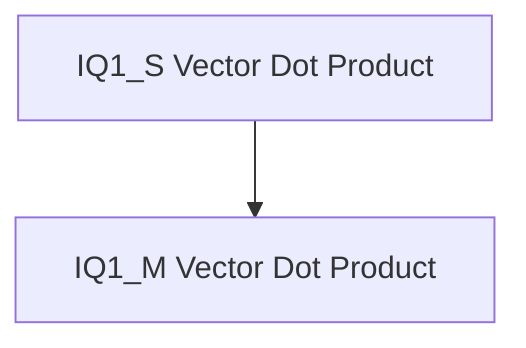

# iq1_vector_dot_products Module Documentation

## Introduction

The `iq1_vector_dot_products` module provides highly optimized implementations for vector dot products involving IQ1 quantized tensors, specifically tailored for x86 architectures leveraging AVX and AVX2 instruction sets. This module is crucial for efficient execution of quantized neural network operations, significantly impacting performance in machine learning inference tasks.

## Architecture Overview

The module is structured to handle two primary IQ1 quantization schemes: IQ1_S (symmetric) and IQ1_M (mixed). Each scheme has its dedicated vector dot product implementation, optimized for performance on compatible x86 CPUs. These implementations interact with `block_iq1_s` and `block_iq1_m` tensor types, as well as `block_q8_K` for the other operand.

<!-- DIAGRAM_JSON
{
    "direction": "TD",
    "nodes": [
        {"id": "iq1_s_vector_dot", "label": "IQ1_S Vector Dot Product", "type": "module", "link": "iq1_s_vector_dot.md"},
        {"id": "iq1_m_vector_dot", "label": "IQ1_M Vector Dot Product", "type": "module", "link": "iq1_m_vector_dot.md"}
    ],
    "edges": [
        {"source": "iq1_s_vector_dot", "target": "iq1_m_vector_dot", "label": "related to"}
    ],
    "groups": []
}
-->

## Sub-modules

This module comprises the following sub-modules, each providing specialized vector dot product functionalities:

- ### [IQ1_S Vector Dot Product](iq1_s_vector_dot.md)
  Implements the vector dot product for IQ1_S quantized tensors using AVX2 and AVX instructions. This sub-module focuses on symmetric quantization for efficient computation.

- ### [IQ1_M Vector Dot Product](iq1_m_vector_dot.md)
  Implements the vector dot product for IQ1_M quantized tensors, optimized with AVX2 and AVX intrinsics. This sub-module handles mixed quantization schemes, offering flexibility in quantization strategies.
