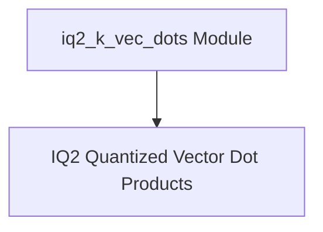

# IQ2 K-Vec-Dots Module Documentation

## Introduction
The `iq2_k_vec_dots` module is a crucial component within the `ggml-cpu.arch.x86.quants` sub-system, specifically designed to handle highly optimized vector dot product operations for various IQ2 quantization schemes (IQ2_xs, IQ2_s, IQ2_xxs) on x86 architectures. This module leverages advanced instruction sets like AVX2 and AVX to achieve significant performance gains in quantized tensor computations, which are fundamental for efficient execution of machine learning models.

## Architecture
The `iq2_k_vec_dots` module integrates closely with the broader `ggml_cpu_x86_quants` framework, providing specialized vector dot product functions. It acts as a low-level computation engine, directly interfacing with quantized data structures and producing scalar results. Its primary relationship is with the higher-level quantization logic that orchestrates the use of these optimized dot product kernels.

<!-- DIAGRAM_JSON
{
    "direction": "TD",
    "nodes": [
        {"id": "iq2_quantized_vector_dot_products", "label": "IQ2 Quantized Vector Dot Products", "type": "module", "link": "iq2_quantized_vector_dot_products.md"}
    ],
    "edges": [],
    "groups": []
}
-->

## High-Level Functionality

### IQ2 Quantized Vector Dot Products
This sub-module encapsulates the core logic for performing highly efficient vector dot products with IQ2_xs, IQ2_s, and IQ2_xxs quantization. These functions are critical for accelerating quantized inference operations on x86 CPUs. For detailed information, refer to the [IQ2 Quantized Vector Dot Products Documentation](iq2_quantized_vector_dot_products.md).
