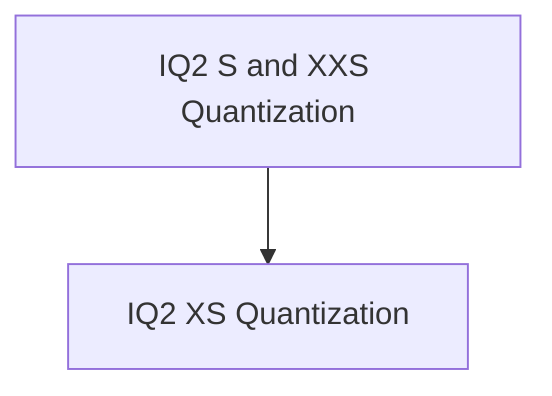

# IQ2 Quantization Kernels

## Introduction

The `iq2_quantization_kernels` module provides optimized vector dot product implementations specifically designed for IQ2 quantized data types (IQ2_XS, IQ2_S, IQ2_XXS) interacting with Q8_K quantized data. These kernels are crucial for efficient execution of quantized neural network models on ARM-based CPUs, leveraging ARM NEON intrinsics for performance acceleration.

## Architecture

This module is a part of the `ggml_cpu_arm_quants` family, residing within the `ggml` backend for CPU architectures, specifically targeting ARM. It focuses on low-level, highly optimized dot product operations essential for quantized tensor computations.

The module is structured into the following sub-modules:

- **IQ2 XS Quantization** (`iq2_xs_quantization.md`): Handles vector dot products for IQ2_XS quantized data.
- **IQ2 S and XXS Quantization** (`iq2_s_xxs_quantization.md`): Manages vector dot products for IQ2_S and IQ2_XXS quantized data.

<!-- DIAGRAM_JSON
{
    "direction": "TD",
    "nodes": [
        {"id": "iq2_xs_quantization", "label": "IQ2 XS Quantization", "type": "module", "link": "iq2_xs_quantization.md"},
        {"id": "iq2_s_xxs_quantization", "label": "IQ2 S and XXS Quantization", "type": "module", "link": "iq2_s_xxs_quantization.md"}
    ],
    "edges": [
        {"source": "iq2_s_xxs_quantization", "target": "iq2_xs_quantization"}
    ],
    "groups": []
}
-->

## Module Functionality

### IQ2 XS Quantization
This sub-module provides the core implementation for computing the vector dot product between `block_iq2_xs` (IQ2_XS quantized data) and `block_q8_K` (Q8_K quantized data). It utilizes ARM NEON intrinsics for optimized performance on compatible hardware.

### IQ2 S and XXS Quantization
This sub-module provides core implementations for computing the vector dot product for `block_iq2_s` (IQ2_S quantized data) and `block_iq2_xxs` (IQ2_XXS quantized data) against `block_q8_K` (Q8_K quantized data). It leverages ARM NEON intrinsics to accelerate these specialized quantization operations.
