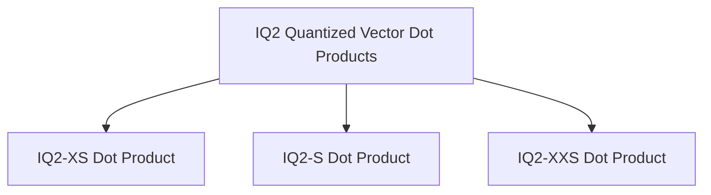

# IQ2 Quantized Vector Dot Products Module

## Introduction

The `iq2_quantized_vector_dot_products` module provides highly optimized implementations of vector dot product calculations for various IQ2 (Integer Quantization level 2) quantized data types. These implementations leverage x86 CPU architecture extensions like AVX and AVX2 to achieve significant performance improvements, crucial for efficient execution of quantized neural network operations.

## Architecture

This module is a sub-component of `iq2_k_vec_dots`, which itself is part of the broader `ggml_cpu_x86_quants` module, focusing on CPU-optimized quantization operations for x86 architectures. It contains specialized functions for different IQ2 quantization variants, each tailored for maximum performance.

<!-- DIAGRAM_JSON
{
    "direction": "TD",
    "nodes": [
        {"id": "iq2_xs_dot_product", "label": "IQ2-XS Dot Product", "type": "module", "link": "iq2_xs_dot_product.md"},
        {"id": "iq2_s_dot_product", "label": "IQ2-S Dot Product", "type": "module", "link": "iq2_s_dot_product.md"},
        {"id": "iq2_xxs_dot_product", "label": "IQ2-XXS Dot Product", "type": "module", "link": "iq2_xxs_dot_product.md"}
    ],
    "edges": [
        {"source": "iq2_quantized_vector_dot_products", "target": "iq2_xs_dot_product"},
        {"source": "iq2_quantized_vector_dot_products", "target": "iq2_s_dot_product"},
        {"source": "iq2_quantized_vector_dot_products", "target": "iq2_xxs_dot_product"}
    ],
    "groups": []
}
-->

## Sub-modules

This module is composed of the following specialized sub-modules:

*   **[IQ2-XS Dot Product](iq2_xs_dot_product.md)**: This sub-module contains the implementation for `ggml_vec_dot_iq2_xs_q8_K`, which handles vector dot product calculations for IQ2-XS quantized data, utilizing AVX/AVX2 intrinsics for optimized performance.

*   **[IQ2-S Dot Product](iq2_s_dot_product.md)**: This sub-module includes the `ggml_vec_dot_iq2_s_q8_K` function, responsible for performing highly optimized vector dot product computations for IQ2-S quantized data with AVX/AVX2 extensions.

*   **[IQ2-XXS Dot Product](iq2_xxs_dot_product.md)**: This sub-module provides the `ggml_vec_dot_iq2_xxs_q8_K` function, which manages vector dot product operations for IQ2-XXS quantized data, also leveraging AVX/AVX2 intrinsics for efficient execution.
