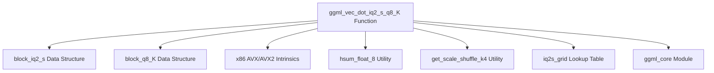

# iq2_s_dot_product Module Documentation

## Introduction

The `iq2_s_dot_product` module provides a highly optimized, architecture-specific implementation for computing the dot product of vectors quantized using the `IQ2_S` and `Q8_K` quantization schemes. This module is a critical component within the `ggml` library's CPU backend, specifically targeting x86 architectures with AVX and AVX2 instruction set extensions to deliver efficient performance for machine learning inference tasks involving quantized models.

## Architecture and Component Relationships

This module is a leaf module focused on a single, highly optimized function. It is part of the `ggml_cpu_x86_quants` family, which specializes in x86-specific quantization operations. It leverages various x86 intrinsics for accelerated computation.

<!-- DIAGRAM_JSON
{
    "direction": "TD",
    "nodes": [
        {"id": "ggml_vec_dot_iq2_s_q8_K", "label": "ggml_vec_dot_iq2_s_q8_K Function", "type": "component", "link": null},
        {"id": "block_iq2_s_struct", "label": "block_iq2_s Data Structure", "type": "component", "link": null},
        {"id": "block_q8_K_struct", "label": "block_q8_K Data Structure", "type": "component", "link": null},
        {"id": "x86_intrinsics", "label": "x86 AVX/AVX2 Intrinsics", "type": "component", "link": null},
        {"id": "hsum_float_8_util", "label": "hsum_float_8 Utility", "type": "component", "link": null},
        {"id": "get_scale_shuffle_k4_util", "label": "get_scale_shuffle_k4 Utility", "type": "component", "link": null},
        {"id": "iq2s_grid_data", "label": "iq2s_grid Lookup Table", "type": "component", "link": null},
        {"id": "ggml_core", "label": "ggml_core Module", "type": "external", "link": "ggml_core.md"}
    ],
    "edges": [
        {"source": "ggml_vec_dot_iq2_s_q8_K", "target": "block_iq2_s_struct"},
        {"source": "ggml_vec_dot_iq2_s_q8_K", "target": "block_q8_K_struct"},
        {"source": "ggml_vec_dot_iq2_s_q8_K", "target": "x86_intrinsics"},
        {"source": "ggml_vec_dot_iq2_s_q8_K", "target": "hsum_float_8_util"},
        {"source": "ggml_vec_dot_iq2_s_q8_K", "target": "get_scale_shuffle_k4_util"},
        {"source": "ggml_vec_dot_iq2_s_q8_K", "target": "iq2s_grid_data"},
        {"source": "ggml_vec_dot_iq2_s_q8_K", "target": "ggml_core"}
    ],
    "groups": []
}
-->


### Core Functionality

The primary component of this module is the `ggml_vec_dot_iq2_s_q8_K` function.

#### `ggml_vec_dot_iq2_s_q8_K`

```c
void ggml_vec_dot_iq2_s_q8_K(int n, float * GGML_RESTRICT s, size_t bs, const void * GGML_RESTRICT vx, size_t bx, const void * GGML_RESTRICT vy, size_t by, int nrc)
```

**Purpose:**
This function computes the dot product of two vectors, `vx` and `vy`, which are quantized using the `IQ2_S` and `Q8_K` quantization formats, respectively. The result is accumulated into a single float scalar `s`. It is heavily optimized for x86 CPUs, specifically utilizing AVX2 and AVX instruction sets for parallel processing.

**Parameters:**
*   `n`: The total number of elements in the vectors. It must be a multiple of `QK_K`.
*   `s`: A pointer to a float where the final dot product result will be stored.
*   `bs`, `bx`, `by`, `nrc`: Block sizes and row counts. These parameters are primarily for API compatibility and are mostly unused in this specific, highly optimized implementation (`assert(nrc == 1)`).
*   `vx`: A pointer to the first vector, expected to be an array of `block_iq2_s` structures.
*   `vy`: A pointer to the second vector, expected to be an array of `block_q8_K` structures.

**Key Operations and Optimizations:**
1.  **Quantized Block Processing:** The function iterates through the input vectors in blocks of `QK_K` elements. Each block consists of `block_iq2_s` and `block_q8_K` structures.
2.  **Scale and Sign Extraction:** It extracts per-block scaling factors (`d`) and per-group scales/signs (`scales`, `qs`, `qh`, `signs`) from the `IQ2_S` quantized data.
3.  **x86 Intrinsics (AVX2/AVX):**
    *   It uses `__m256i` and `__m256` data types to load and process 32-byte (256-bit) chunks of data in parallel.
    *   `_mm256_set_epi64x`: Used to construct `IQ2_S` values by combining `qs` and `qh` components with `iq2s_grid` lookup table.
    *   `_mm256_shuffle_epi8`: Employed with `k_mask1` and `k_mask2` to correctly extract and apply sign bits based on the `signs` array.
    *   `_mm256_cmpeq_epi8`, `_mm256_xor_si256`, `_mm256_sub_epi8`: Used for sign-flipping the `Q8_K` values where necessary based on the `IQ2_S` signs.
    *   `_mm256_maddubs_epi16`: Performs multiply-add on unsigned bytes and signed bytes, producing 16-bit intermediate sums. This is crucial for efficient dot product accumulation.
    *   `_mm256_madd_epi16`: Further accumulates 16-bit products into 32-bit sums.
    *   `_mm256_cvtepi32_ps`: Converts 32-bit integer sums to single-precision floating-point numbers.
    *   `_mm256_fmadd_ps` (FMA - Fused Multiply-Add) or `_mm256_add_ps` and `_mm256_mul_ps`: Combines the block's scaling factor (`d`) with the accumulated integer sums, adding to the overall dot product accumulator.
4.  **Horizontal Summation:** After processing all blocks, `hsum_float_8` is used to sum the 8 floating-point values in the `__m256` accumulator into a single scalar, which is then scaled by `0.125f` to produce the final result.

**Dependencies:**
*   **`block_iq2_s` and `block_q8_K`:** Data structures defining the layout of quantized blocks. These are fundamental to the `ggml` quantization scheme.
*   **x86 Intrinsics (`<immintrin.h>`):** Direct usage of AVX/AVX2 instructions for high-performance vectorized operations.
*   **`GGML_CPU_FP16_TO_FP32` (from [ggml_core.md](ggml_core.md)):** A macro for converting half-precision floats to single-precision floats.
*   **`hsum_float_8`:** A utility function for summing elements of a `__m256` vector horizontally.
*   **`get_scale_shuffle_k4`:** A utility function used to generate shuffle masks for scales.
*   **`iq2s_grid`:** A lookup table specific to `IQ2_S` quantization, used to reconstruct quantized values.

## How it Fits into the Overall System

The `iq2_s_dot_product` module is a low-level, performance-critical component within the `ggml` inference engine. It is specifically called when the model's weights and activations are quantized using the `IQ2_S` and `Q8_K` formats, and the computation is being performed on an x86 CPU.

It sits within the `ggml_cpu_x86_quants` hierarchy, making it a specialized implementation for a particular quantization and hardware combination. This modularity allows `ggml` to provide highly optimized kernels for various CPU architectures and quantization types, contributing significantly to the overall efficiency and speed of quantized model inference on x86 platforms. By providing an optimized dot product, it directly impacts the performance of matrix multiplications and other linear algebra operations fundamental to neural network computations.
