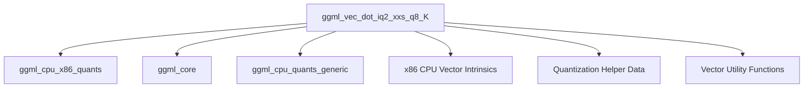

# iq2_xxs_dot_product Module Documentation

## Introduction

The `iq2_xxs_dot_product` module is a specialized component within the `ggml` library, focusing on highly optimized vector dot product computations for quantized data on x86 architectures. Specifically, this module implements the `ggml_vec_dot_iq2_xxs_q8_K` function, which performs dot products between `IQ2_XXS` and `Q8_K` quantized block types. Its primary role is to provide efficient low-level routines essential for accelerated inference with quantized machine learning models, leveraging CPU-specific instruction sets like AVX2 and AVX.

## Core Functionality

The `ggml_vec_dot_iq2_xxs_q8_K` function is the cornerstone of this module. It is designed to compute the dot product of two vectors, where one vector is represented in the `IQ2_XXS` quantization format and the other in the `Q8_K` format. This function is critical for performance-sensitive operations in quantized neural networks, such as matrix multiplications and convolutions.

### `ggml_vec_dot_iq2_xxs_q8_K`

```c
void ggml_vec_dot_iq2_xxs_q8_K(int n, float * GGML_RESTRICT s, size_t bs, const void * GGML_RESTRICT vx, size_t bx, const void * GGML_RESTRICT vy, size_t by, int nrc);
```

**Parameters:**

*   `n`: The total number of elements in the vectors.
*   `s`: Pointer to the output scalar result of the dot product.
*   `bs`, `bx`, `by`: Block sizes (unused in this specific implementation, but part of the general API).
*   `vx`: Pointer to the first vector, expected to be `block_iq2_xxs` type.
*   `vy`: Pointer to the second vector, expected to be `block_q8_K` type.
*   `nrc`: Number of row columns (asserted to be 1 in this implementation).

**Key Features:**

*   **Quantization Support**: Operates directly on `IQ2_XXS` and `Q8_K` quantized blocks, minimizing memory footprint and bandwidth requirements.
*   **x86 Optimizations**: Utilizes AVX2 and AVX instruction sets for highly parallel and efficient computation. This involves specific intrinsics like `_mm256_loadu_si256`, `_mm256_set_epi64x`, `_mm256_sign_epi8`, `_mm256_maddubs_epi16`, `_mm256_madd_epi16`, `_mm256_add_epi32`, `_mm256_cvtepi32_ps`, `_mm256_fmadd_ps`, and `hsum_float_8` for AVX2, and similar `_mm_` intrinsics for AVX.
*   **Fallback Mechanism**: Includes a generic C implementation (`ggml_vec_dot_iq2_xxs_q8_K_generic`) that is used if specific x86 extensions (AVX2/AVX) are not available at compile time or runtime, ensuring broad compatibility.
*   **Efficiency**: Designed for high throughput by processing multiple elements simultaneously, which is crucial for modern deep learning workloads.

## Architecture and Component Relationships

This module is a leaf component within the `ggml` CPU backend, specifically tailored for x86 architectures and integer quantization types. It directly depends on data structures and utility functions defined within the broader `ggml` framework and leverages low-level CPU features.

<!-- DIAGRAM_JSON
{
    "direction": "TD",
    "nodes": [
        {"id": "vec_dot_iq2_xxs_q8_K", "label": "ggml_vec_dot_iq2_xxs_q8_K", "type": "component", "link": null},
        {"id": "x86_quants", "label": "ggml_cpu_x86_quants", "type": "external", "link": "ggml_cpu_x86_quants.md"},
        {"id": "ggml_core", "label": "ggml_core", "type": "external", "link": "ggml_core.md"},
        {"id": "generic_quants", "label": "ggml_cpu_quants_generic", "type": "external", "link": "ggml_cpu_quants_generic.md"},
        {"id": "x86_cpu_features", "label": "x86 CPU Vector Intrinsics", "type": "component", "link": null},
        {"id": "quant_helpers", "label": "Quantization Helper Data", "type": "component", "link": null},
        {"id": "vec_utils", "label": "Vector Utility Functions", "type": "component", "link": null}
    ],
    "edges": [
        {"source": "vec_dot_iq2_xxs_q8_K", "target": "x86_quants"},
        {"source": "vec_dot_iq2_xxs_q8_K", "target": "ggml_core"},
        {"source": "vec_dot_iq2_xxs_q8_K", "target": "generic_quants"},
        {"source": "vec_dot_iq2_xxs_q8_K", "target": "x86_cpu_features"},
        {"source": "vec_dot_iq2_xxs_q8_K", "target": "quant_helpers"},
        {"source": "vec_dot_iq2_xxs_q8_K", "target": "vec_utils"}
    ],
    "groups": []
}
-->


## Module Integration

The `iq2_xxs_dot_product` module is an integral part of the `ggml` CPU backend, specifically nested within the `ggml_cpu_x86_quants` hierarchy. It resides under `iq2_quantized_vector_dot_products`, which in turn is part of `iq2_k_vec_dots`, `integer_k_vec_dots`, and `x86_vec_dot_k_quants`. This placement signifies its role in providing highly optimized, architecture-specific quantization routines.

It receives requests for dot product computations involving `IQ2_XXS` and `Q8_K` quantized tensors and performs these operations leveraging available x86 CPU features. The results are then passed back up the call stack for further processing within the `ggml` graph execution.

### Dependencies and Relationships:

*   **Parent Module**: `iq2_quantized_vector_dot_products` (conceptual, within the hierarchy defined in [x86_vec_dot_k_quants.md](x86_vec_dot_k_quants.md))
*   **Higher-Level Quantization**: Relates to general x86 quantization strategies defined in [ggml_cpu_x86_quants.md](ggml_cpu_x86_quants.md).
*   **Core GGML Utilities**: Relies on fundamental types, macros, and utility functions provided by the [ggml_core.md](ggml_core.md) module.
*   **Generic Fallback**: Uses the generic quantization functions defined in [ggml_cpu_quants_generic.md](ggml_cpu_quants_generic.md) when specific x86 optimizations are not applicable.