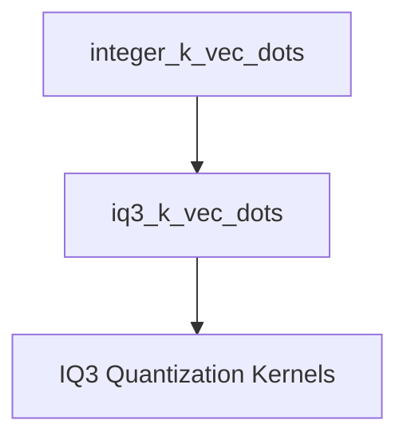

# iq3_k_vec_dots Module Documentation

## Introduction and Purpose

The `iq3_k_vec_dots` module provides highly optimized vector dot product functions specifically tailored for IQ3 quantization, primarily targeting x86 architectures with AVX2 and AVX instruction sets. These functions are critical for efficient neural network inference, enabling faster computation by working with quantized 3-bit integer weights. This module is a specialized component within the broader `integer_k_vec_dots` family, focusing on a particular quantization scheme to maximize performance on compatible CPUs.

## Architecture Overview

The `iq3_k_vec_dots` module is a leaf module in the `integer_k_vec_dots` hierarchy, which itself is part of the `x86_vec_dot_k_quants` within the `ggml_cpu_x86_quants` component of the GGML backend. It primarily exposes its optimized kernel implementations for use by higher-level quantization and compute routines.

The module contains the `iq3_quantization_kernels` sub-module, which encapsulates the core vector dot product implementations.

<!-- DIAGRAM_JSON
{
    "direction": "TD",
    "nodes": [
        {"id": "iq3_k_vec_dots", "label": "iq3_k_vec_dots", "type": "module"},
        {"id": "integer_k_vec_dots", "label": "integer_k_vec_dots", "type": "external", "link": "integer_k_vec_dots.md"},
        {"id": "iq3_quantization_kernels", "label": "IQ3 Quantization Kernels", "type": "module", "link": "iq3_quantization_kernels.md"}
    ],
    "edges": [
        {"source": "integer_k_vec_dots", "target": "iq3_k_vec_dots"},
        {"source": "iq3_k_vec_dots", "target": "iq3_quantization_kernels"}
    ],
    "groups": []
}
-->

## Sub-modules

### [IQ3 Quantization Kernels](iq3_quantization_kernels.md)
This sub-module contains the core implementations for vector dot products using IQ3 quantization. It provides optimized routines, leveraging x86 specific instruction sets like AVX2 and AVX, to accelerate the computation of quantized tensors.
