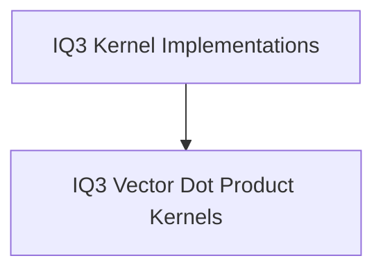

# IQ3 Kernel Implementations

This module provides the core implementation for specialized vector dot product kernels used in IQ3 quantization. These kernels are highly optimized for x86 architectures, leveraging AVX2 and AVX instruction sets to accelerate computations involving IQ3 quantized data.

## Architecture Overview

The `iq3_kernel_implementations` module is a leaf node in the `ggml` CPU backend's quantization hierarchy. It specifically houses the high-performance kernels for IQ3 quantization, which are utilized by higher-level quantization modules within the `ggml_cpu_x86_quants` family.

<!-- DIAGRAM_JSON
{
    "direction": "TD",
    "nodes": [
        {"id": "iq3_kernel_implementations", "label": "IQ3 Kernel Implementations", "type": "module", "link": "iq3_kernel_implementations.md"},
        {"id": "iq3_vec_dot_kernels", "label": "IQ3 Vector Dot Product Kernels", "type": "module", "link": "iq3_vec_dot_kernels.md"}
    ],
    "edges": [
        {"source": "iq3_kernel_implementations", "target": "iq3_vec_dot_kernels"}
    ],
    "groups": []
}
-->

## Sub-modules

* [IQ3 Vector Dot Product Kernels](iq3_vec_dot_kernels.md)
