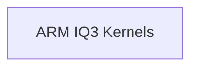

# IQ3 Quantization Kernels

## Introduction

The `iq3_quantization_kernels` module provides highly optimized implementations of vector dot product operations specifically tailored for IQ3 quantization on ARM NEON architectures. These kernels are critical for efficient inference in quantized neural networks, leveraging ARM's SIMD capabilities to accelerate computations.

## Architecture Overview

This module is a specialized component within the `ggml-cpu.arch.arm.quants` family, designed to handle integer quantization level 3 (IQ3) computations. It integrates closely with the underlying ARM NEON instruction set to maximize performance for `ggml_vec_dot` operations. The design focuses on minimizing memory access and maximizing parallel execution for quantized data types.

<!-- DIAGRAM_JSON
{
    "direction": "TD",
    "nodes": [
        {"id": "arm_iq3_kernels", "label": "ARM IQ3 Kernels", "type": "module", "link": "arm_iq3_kernels.md"}
    ],
    "edges": [],
    "groups": []
}
-->

## Sub-modules

*   ### [ARM IQ3 Kernels](arm_iq3_kernels.md)
    This sub-module contains the core ARM NEON optimized functions for IQ3 vector dot products, including `ggml_vec_dot_iq3_s_q8_K` and `ggml_vec_dot_iq3_xxs_q8_K`.

