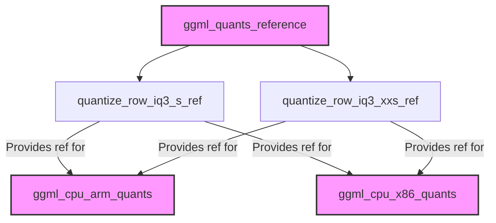

# Module: iq3_reference_kernels

## Introduction
The `iq3_reference_kernels` module provides reference implementations for quantizing floating-point data into IQ3-S and IQ3-XXS formats. These kernels serve as a baseline for understanding the IQ3 quantization scheme within the GGML library, particularly for use in [ggml_quants_reference.md](ggml_quants_reference.md).

## Core Functionality

### `quantize_row_iq3_s_ref`
This function quantizes a row of 32-bit floating-point numbers into the `block_iq3_s` format. It ensures that the input `k` (number of elements) is a multiple of `QK_K` for proper block processing. This function internally calls a core IQ3-S quantization routine.

### `quantize_row_iq3_xxs_ref`
Similar to `quantize_row_iq3_s_ref`, this function quantizes a row of 32-bit floating-point numbers into the `block_iq3_xxs` format. It also validates that the input `k` is a multiple of `QK_K` and delegates the actual quantization to an internal IQ3-XXS implementation, specifically `quantize_row_iq3_xxs_impl`.

## Architecture and Component Relationships

The `iq3_reference_kernels` module contains the fundamental reference implementations for IQ3 quantization. These kernels are called by higher-level quantization functions within the [ggml_quants_reference.md](ggml_quants_reference.md) module. They act as non-optimized, clear implementations of the IQ3 quantization logic, which can be contrasted with the performance-optimized kernels found in platform-specific modules like [ggml_cpu_arm_quants.md](ggml_cpu_arm_quants.md) and [ggml_cpu_x86_quants.md](ggml_cpu_x86_quants.md).

## Overall System Fit

This module is a sub-module of [ggml_quants_reference.md](ggml_quants_reference.md), which is part of the broader GGML quantization framework. It provides the foundational reference implementations for IQ3 quantization, crucial for correctness validation and as a blueprint for optimized versions. The [ggml_quants_reference.md](ggml_quants_reference.md) module aggregates various reference quantization routines. Optimized, platform-specific implementations for IQ3 quantization, leveraging ARM (see [ggml_cpu_arm_quants.md](ggml_cpu_arm_quants.md)) or x86 (see [ggml_cpu_x86_quants.md](ggml_cpu_x86_quants.md)) intrinsics, often use these reference kernels as a benchmark or for verification.

<!-- DIAGRAM_JSON
{
    "direction": "TD",
    "nodes": [
        {"id": "quantize_row_iq3_s_ref", "label": "quantize_row_iq3_s_ref", "type": "component", "link": null},
        {"id": "quantize_row_iq3_xxs_ref", "label": "quantize_row_iq3_xxs_ref", "type": "component", "link": null},
        {"id": "ggml_quants_reference", "label": "ggml_quants_reference", "type": "external", "link": "ggml_quants_reference.md"},
        {"id": "ggml_cpu_arm_quants", "label": "ggml_cpu_arm_quants", "type": "external", "link": "ggml_cpu_arm_quants.md"},
        {"id": "ggml_cpu_x86_quants", "label": "ggml_cpu_x86_quants", "type": "external", "link": "ggml_cpu_x86_quants.md"}
    ],
    "edges": [
        {"source": "ggml_quants_reference", "target": "quantize_row_iq3_s_ref"},
        {"source": "ggml_quants_reference", "target": "quantize_row_iq3_xxs_ref"},
        {"source": "quantize_row_iq3_s_ref", "target": "ggml_cpu_arm_quants", "label": "Provides ref for"},
        {"source": "quantize_row_iq3_s_ref", "target": "ggml_cpu_x86_quants", "label": "Provides ref for"},
        {"source": "quantize_row_iq3_xxs_ref", "target": "ggml_cpu_arm_quants", "label": "Provides ref for"},
        {"source": "quantize_row_iq3_xxs_ref", "target": "ggml_cpu_x86_quants", "label": "Provides ref for"}
    ],
    "groups": []
}
-->
