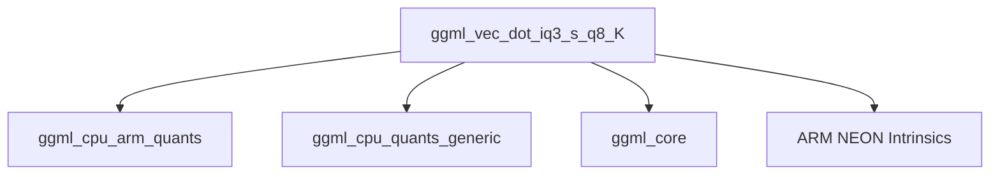

# `iq3_s_kernel` Module Documentation

## Introduction

The `iq3_s_kernel` module provides highly optimized low-level kernel implementations for performing vector dot product operations on IQ3-S quantized data specifically for ARM architectures with NEON support. This module is a critical component within the GGML CPU backend, enabling efficient inference of quantized neural network models by leveraging ARM's advanced SIMD capabilities.

## Architecture and Component Relationships

The `iq3_s_kernel` module contains the `ggml_vec_dot_iq3_s_q8_K` function, which computes the dot product of an IQ3-S quantized vector with a Q8_K quantized vector. This function is an integral part of the ARM-specific quantization kernels, ensuring high performance for quantized models.

### Core Functionality

*   **`ggml_vec_dot_iq3_s_q8_K`**: Performs a fused dequantization and dot product operation between IQ3-S and Q8_K quantized blocks. It utilizes ARM NEON intrinsics for significant performance gains, processing multiple data points simultaneously.

### Module Dependencies

The `iq3_s_kernel` module relies on several external components and modules:

*   **`ggml_cpu_arm_quants`**: The overarching module for ARM CPU quantization kernels, providing common definitions and potentially other related quantization routines. This module is a direct parent in the hierarchy.
*   **`ggml_cpu_quants_generic`**: Provides a generic, non-optimized fallback implementation (`ggml_vec_dot_iq3_s_q8_K_generic`) that is used when ARM NEON support is not available or enabled.
*   **`ggml_core`**: Supplies fundamental GGML constants (`QK_K`), macros (e.g., `GGML_CPU_FP16_TO_FP32`), and potentially the definitions for quantized block structures like `block_iq3_s` and `block_q8_K`, which are essential for the kernel's operation.
*   **ARM NEON Intrinsics**: Directly uses ARM NEON instructions for vectorized computations, which are crucial for achieving high performance on ARM processors.

## System Integration

This module plays a vital role in the `llama_cpp` library's ability to perform efficient model inference on ARM-based systems. By providing a highly optimized kernel for IQ3-S quantization, it directly contributes to reducing computational load and accelerating neural network operations within the GGML framework. It integrates into the CPU backend by offering a specialized implementation that the higher-level GGML components can invoke when targeting ARM processors and IQ3-S quantized models.

<!-- DIAGRAM_JSON
{
    "direction": "TD",
    "nodes": [
        {"id": "ggml_vec_dot_iq3_s_q8_K", "label": "ggml_vec_dot_iq3_s_q8_K", "type": "component", "link": null},
        {"id": "ggml_cpu_arm_quants", "label": "ggml_cpu_arm_quants", "type": "external", "link": "ggml_cpu_arm_quants.md"},
        {"id": "ggml_cpu_quants_generic", "label": "ggml_cpu_quants_generic", "type": "external", "link": "ggml_cpu_quants_generic.md"},
        {"id": "ggml_core", "label": "ggml_core", "type": "external", "link": "ggml_core.md"},
        {"id": "arm_neon_intrinsics", "label": "ARM NEON Intrinsics", "type": "external", "link": null}
    ],
    "edges": [
        {"source": "ggml_vec_dot_iq3_s_q8_K", "target": "ggml_cpu_arm_quants"},
        {"source": "ggml_vec_dot_iq3_s_q8_K", "target": "ggml_cpu_quants_generic"},
        {"source": "ggml_vec_dot_iq3_s_q8_K", "target": "ggml_core"},
        {"source": "ggml_vec_dot_iq3_s_q8_K", "target": "arm_neon_intrinsics"}
    ],
    "groups": []
}
-->

