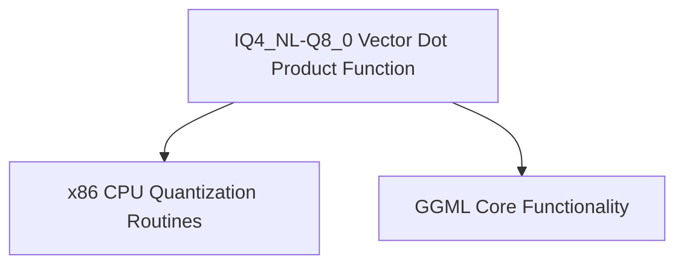

# `iq4_nl_dot_products` Module Documentation

## Introduction

The `iq4_nl_dot_products` module provides highly optimized vector dot product implementations specifically for the IQ4_NL and Q8_0 quantization formats on x86 architectures. This module is a crucial part of the GGML CPU backend, enabling efficient computation for neural network inference by leveraging x86 intrinsic functions (like AVX2 and AVX).

## Architecture and Component Relationships

This module contains a single core function, `ggml_vec_dot_iq4_nl_q8_0`, which is responsible for computing the dot product between a vector quantized in the IQ4_NL format and another in the Q8_0 format. It optimizes these operations using SIMD instructions available on modern x86 processors.

<!-- DIAGRAM_JSON
{
    "direction": "TD",
    "nodes": [
        {"id": "iq4_nl_dot_product_func", "label": "IQ4_NL-Q8_0 Vector Dot Product Function", "type": "component", "link": null},
        {"id": "ggml_cpu_x86_quants", "label": "x86 CPU Quantization Routines", "type": "external", "link": "ggml_cpu_x86_quants.md"},
        {"id": "ggml_core", "label": "GGML Core Functionality", "type": "external", "link": "ggml_core.md"}
    ],
    "edges": [
        {"source": "iq4_nl_dot_product_func", "target": "ggml_cpu_x86_quants"},
        {"source": "iq4_nl_dot_product_func", "target": "ggml_core"}
    ],
    "groups": []
}
-->

### Core Components

#### `ggml_vec_dot_iq4_nl_q8_0`

-   **File**: `ml/backend/ggml/ggml/src/ggml-cpu/arch/x86/quants.c`
-   **Purpose**: This function computes the dot product of two quantized vectors. It takes an IQ4_NL quantized vector (`vx`) and a Q8_0 quantized vector (`vy`), and returns their dot product in `s`. The implementation is highly optimized for x86 CPUs, utilizing AVX2 and AVX instruction sets for parallel processing of vector elements. It iterates through blocks of quantized data, dequantizes them using `kvalues_iq4nl`, and performs fused multiply-add operations to efficiently accumulate the sum.
-   **Key Operations**:
    -   Handles `n` elements in blocks of `QK4_NL`.
    -   Leverages `_mm256_setzero_ps` for initializing sum accumulators.
    -   Uses `_mm_loadu_si128`, `_mm256_loadu_si256` for loading quantized data.
    -   Applies `_mm_shuffle_epi8` with `kvalues_iq4nl` for dequantization.
    -   Employs `mul_add_epi8`, `_mm256_madd_epi16`, and `_mm256_fmadd_ps` for efficient SIMD computation.
    -   Final sum accumulated using `hsum_float_8`.
    -   Includes a scalar fallback loop for remaining elements or non-AVX/AVX2 environments.
-   **Dependencies**:
    -   **Data Structures**: `block_iq4_nl`, `block_q8_0` (define the quantized block formats).
    -   **Constants**: `QK4_NL`, `QK8_0` (block sizes for quantization).
    -   **Dequantization Values**: `kvalues_iq4nl` (lookup table for IQ4_NL dequantization).
    -   **Utility Macros/Functions**: `GGML_CPU_FP16_TO_FP32` (for floating-point conversion), `hsum_float_8` (horizontal sum for SIMD results), and various other AVX/AVX2 intrinsics helpers.

## How the Module Fits into the Overall System

The `iq4_nl_dot_products` module is an integral part of the `ggml_cpu_x86_quants` sub-module, which itself is a specialized component of the broader GGML CPU backend. It provides a critical, performance-sensitive operation for quantized neural network models, particularly for architectures that utilize IQ4_NL and Q8_0 quantization schemes. By offering an optimized dot product function, this module directly contributes to the high-speed inference capabilities of GGML on x86 processors. It works in conjunction with other quantization and vector operation modules within the GGML ecosystem to ensure efficient model execution. The function is typically called by higher-level GGML operations that require efficient matrix or vector multiplications involving these specific quantized formats.