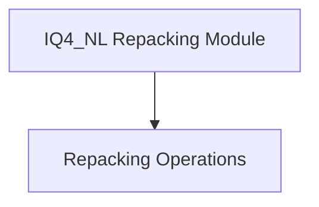

# IQ4_NL Repacking Module

## Introduction

The `iq4_nl_repacking` module is a crucial component within the `ggml_cpu_repack` module, specifically designed for optimizing the data layout of `IQ4_NL` quantized tensors. Its primary function is to repack these tensors into a more efficient block-interleaved format, which significantly enhances performance during CPU-based inference operations.

## Architecture Overview

This module sits within the `ggml_cpu_repack` directory, which is part of the broader `ggml_cpu_x86_quants` and `ggml_cpu_arm_quants` ecosystem. It acts as a specialized data transformer, taking raw `IQ4_NL` tensor data and converting it into a structured format optimized for different interleave block sizes (e.g., 4 or 8 blocks). This repacking is essential for leveraging CPU-specific optimizations, such as vectorization, to accelerate quantized model computations.

<!-- DIAGRAM_JSON
{
    "direction": "TD",
    "nodes": [
        {"id": "repacking_operations", "label": "Repacking Operations", "type": "module", "link": "repacking_operations.md"}
    ],
    "edges": [],
    "groups": []
}
-->

## Sub-modules

### [Repacking Operations](repacking_operations.md)

This sub-module contains the core logic for transforming `IQ4_NL` quantized tensor data into block-interleaved formats. It provides specialized functions to handle repacking for different interleave block sizes, crucial for optimizing data access patterns and computational efficiency on the CPU.
