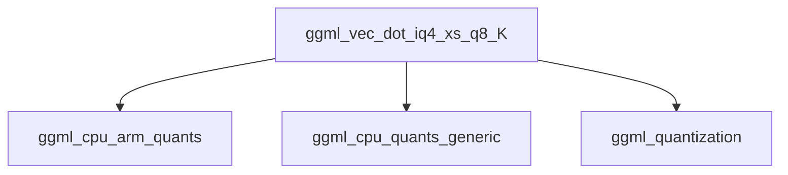

# Module: `iq4_quantization_kernels`

This module provides specialized kernels for performing vector dot product operations on IQ4_XS and Q8_K quantized data types, specifically optimized for ARM NEON architectures. It is a critical component within the GGML library's CPU backend for efficient execution of quantized neural network operations.

## Architecture and Component Relationships

The `iq4_quantization_kernels` module primarily contains the `ggml_vec_dot_iq4_xs_q8_K` function. This function implements an optimized vector dot product for IQ4_XS and Q8_K quantization schemes, leveraging ARM NEON intrinsics for high performance on compatible CPUs. In environments where ARM NEON is not available, it falls back to a generic implementation provided by the `ggml_cpu_quants_generic` module.

The function operates on `block_iq4_xs` and `block_q8_K` data structures, which define the format of the quantized input vectors. These block definitions are managed by the `ggml_quantization` module. The core logic involves processing quantized blocks, performing table lookups, and accumulating dot products with appropriate scaling factors.

<!-- DIAGRAM_JSON
{
    "direction": "TD",
    "nodes": [
        {"id": "ggml_vec_dot_iq4_xs_q8_K", "label": "ggml_vec_dot_iq4_xs_q8_K", "type": "component", "link": null},
        {"id": "ggml_cpu_arm_quants", "label": "ggml_cpu_arm_quants", "type": "external", "link": "ggml_cpu_arm_quants.md"},
        {"id": "ggml_cpu_quants_generic", "label": "ggml_cpu_quants_generic", "type": "external", "link": "ggml_cpu_quants_generic.md"},
        {"id": "ggml_quantization", "label": "ggml_quantization", "type": "external", "link": "ggml_quantization.md"}
    ],
    "edges": [
        {"source": "ggml_vec_dot_iq4_xs_q8_K", "target": "ggml_cpu_arm_quants"},
        {"source": "ggml_vec_dot_iq4_xs_q8_K", "target": "ggml_cpu_quants_generic"},
        {"source": "ggml_vec_dot_iq4_xs_q8_K", "target": "ggml_quantization"}
    ],
    "groups": []
}
-->



### Core Components

#### `ggml_vec_dot_iq4_xs_q8_K`

```c
void ggml_vec_dot_iq4_xs_q8_K(int n, float * GGML_RESTRICT s, size_t bs, const void * GGML_RESTRICT vx, size_t bx, const void * GGML_RESTRICT vy, size_t by, int nrc) {
    assert(nrc == 1);
    UNUSED(nrc);
    UNUSED(bx);
    UNUSED(by);
    UNUSED(bs);
    assert(n % QK_K == 0);

    const block_iq4_xs * GGML_RESTRICT x = vx;
    const block_q8_K   * GGML_RESTRICT y = vy;

    const int nb = n / QK_K;

#if defined __ARM_NEON
    const int8x16_t values = vld1q_s8(kvalues_iq4nl);
    const uint8x16_t m4b = vdupq_n_u8(0x0f);
    ggml_uint8x16x2_t q4bits;
    ggml_int8x16x4_t q4b;
    ggml_int8x16x4_t q8b;
    int32x4_t prod_1, prod_2;

    float sumf = 0;

    for (int ibl = 0; ibl < nb; ++ibl) {

        const int8_t  * q8 = y[ibl].qs;
        const uint8_t * q4 = x[ibl].qs;
        uint16_t h = x[ibl].scales_h;

        int sumi1 = 0, sumi2 = 0;
        for (int ib = 0; ib < QK_K/64; ++ib) {

            q4bits = ggml_vld1q_u8_x2(q4); q4 += 32;
            q8b    = ggml_vld1q_s8_x4(q8); q8 += 64;

            q4b.val[0] = ggml_vqtbl1q_s8(values, vandq_u8  (q4bits.val[0], m4b));
            q4b.val[1] = ggml_vqtbl1q_s8(values, vshrq_n_u8(q4bits.val[0], 4));
            q4b.val[2] = ggml_vqtbl1q_s8(values, vandq_u8  (q4bits.val[1], m4b));
            q4b.val[3] = ggml_vqtbl1q_s8(values, vshrq_n_u8(q4bits.val[1], 4));

            prod_1 = ggml_vdotq_s32(ggml_vdotq_s32(vdupq_n_s32(0), q4b.val[0], q8b.val[0]), q4b.val[1], q8b.val[1]);
            prod_2 = ggml_vdotq_s32(ggml_vdotq_s32(vdupq_n_s32(0), q4b.val[2], q8b.val[2]), q4b.val[3], q8b.val[3]);

            int ls1 = ((x[ibl].scales_l[ib] & 0xf) | ((h << 4) & 0x30)) - 32;
            int ls2 = ((x[ibl].scales_l[ib] >>  4) | ((h << 2) & 0x30)) - 32;
            h >>= 4;
            sumi1 += vaddvq_s32(prod_1) * ls1;
            sumi2 += vaddvq_s32(prod_2) * ls2;

        }

        sumf += GGML_CPU_FP16_TO_FP32(x[ibl].d) * y[ibl].d * (sumi1 + sumi2);
    }

    *s = sumf;

#else
    UNUSED(x);
    UNUSED(y);
    UNUSED(nb);
    ggml_vec_dot_iq4_xs_q8_K_generic(n, s, bs, vx, bx, vy, by, nrc);
#endif
}
```
This function computes the dot product of two quantized vectors, `vx` (IQ4_XS) and `vy` (Q8_K). It's highly optimized for ARM NEON, processing data in blocks and utilizing SIMD instructions for efficiency. It incorporates scaling factors (`scales_h`, `scales_l`, `d`) during the accumulation to reconstruct an approximation of the original floating-point dot product. If ARM NEON is not available, it delegates the computation to a generic implementation.

## How the Module Fits into the Overall System

The `iq4_quantization_kernels` module is an integral part of the `ggml_cpu_arm_quants` module, specifically contributing to the `integer_k_vec_dots` sub-module. It provides low-level, highly optimized quantization kernels that are essential for accelerating neural network inference on ARM-based CPUs.

By providing efficient implementations for specific quantization types (IQ4_XS and Q8_K), this module directly supports the performance goals of the GGML library, enabling faster and more memory-efficient execution of models that utilize these quantization schemes. It abstracts away the complexities of ARM NEON programming, offering a clean interface for higher-level GGML operations. Its integration ensures that when quantized models are run on ARM CPUs, these specialized kernels are utilized for optimal performance.
