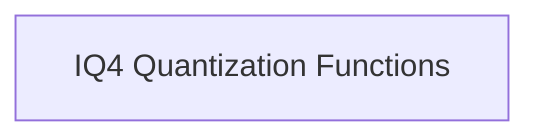

# IQ4 Row Quantization Module

The `iq4_row_quantization` module is responsible for implementing specialized quantization routines for IQ4 data types within the GGML CPU backend. It provides efficient functions to quantize rows of floating-point numbers into the IQ4_NL and IQ4_XS formats, crucial for optimizing memory usage and computation in machine learning models.

## Architecture

This module is structured around core quantization functions, designed for direct application to row data. It integrates with the broader GGML CPU quantization framework.

<!-- DIAGRAM_JSON
{
    "direction": "TD",
    "nodes": [
        {"id": "iq4_quantization_functions", "label": "IQ4 Quantization Functions", "type": "module", "link": "iq4_quantization_functions.md"}
    ],
    "edges": [],
    "groups": []
}
-->

## Sub-modules

### IQ4 Quantization Functions ([iq4_quantization_functions.md](iq4_quantization_functions.md))

This sub-module encapsulates the core logic for quantizing rows using the IQ4_NL and IQ4_XS quantization schemes. It contains the primary functions that perform the actual data transformation and is a key component for enabling efficient IQ4 quantized operations.