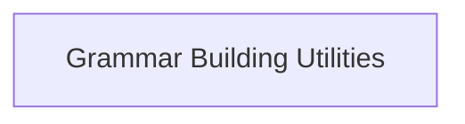

# json_schema_grammar Module Documentation

## Introduction

The `json_schema_grammar` module is a crucial component within the `llama.cpp.common` library, responsible for converting JSON schema definitions into GBNF (GGML BNF) grammar. This conversion enables structured data generation and validation within language models by defining precise rules for output formats.

## Architecture Overview

This module primarily consists of utilities that translate JSON schema constraints, such as literal values and integer ranges, into their corresponding GBNF grammar representations. It integrates with other parts of the `llama_cpp_common` module to facilitate the creation of robust and controlled text generation.

<!-- DIAGRAM_JSON
{
    "direction": "TD",
    "nodes": [
        {"id": "grammar_building_utilities", "label": "Grammar Building Utilities", "type": "module", "link": "grammar_building_utilities.md"}
    ],
    "edges": [],
    "groups": []
}
-->

## Sub-modules

### [Grammar Building Utilities](grammar_building_utilities.md)

This sub-module provides core functionalities for generating GBNF grammar elements, including precise handling of literal values and complex integer range definitions derived from JSON schema. It ensures that the generated grammar adheres to the specified constraints, which is essential for guiding language model outputs.