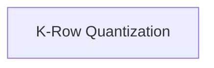

# k_quantization Module Documentation

## Introduction

The `k_quantization` module is a crucial component within the `ggml_cpu_quants_generic` module, specifically designed for various K-quantization schemes on the CPU. It provides core functions for quantizing rows of floating-point numbers into different K-quantized block formats (Q2_K, Q3_K, Q4_K, Q5_K, Q6_K, Q8_K). This module plays a vital role in optimizing model performance by reducing memory footprint and accelerating computations, particularly for large language models.

## Architecture Overview

The `k_quantization` module primarily consists of functions that serve as wrappers around reference implementations for different K-quantization types. These functions take a row of float values and convert them into a specific quantized block format. The module integrates with the broader `ggml` ecosystem, providing low-level quantization primitives that are utilized by higher-level operations and backends.

<!-- DIAGRAM_JSON
{
    "direction": "TD",
    "nodes": [
        {"id": "k_row_quantization", "label": "K-Row Quantization", "type": "module", "link": "k_row_quantization.md"}
    ],
    "edges": [],
    "groups": []
}
-->

## Sub-modules

*   **[K-Row Quantization](k_row_quantization.md)**: This sub-module contains the core functions for performing row-wise quantization using various K-quantization formats. These functions serve as wrappers to optimized reference implementations.
