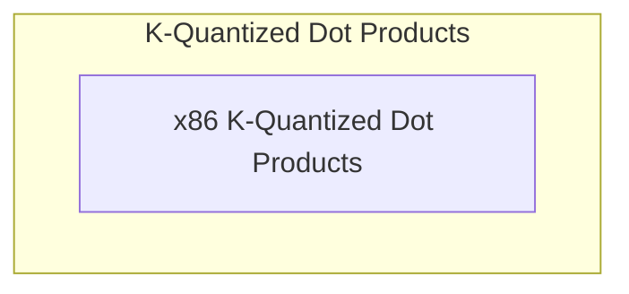

# K-Quantized Dot Products

## Introduction
The `k_quantized_dot_products` module provides highly optimized implementations for vector dot products involving K-quantized data types (Q4_K, Q5_K, Q6_K) and Q8_K. These specialized routines are crucial for efficient execution of quantized neural networks on x86 architectures, leveraging advanced CPU intrinsics like AVX2 and AVX for significant performance gains.

## Architecture
This module is a part of the `ggml_cpu_x86_quants` family, focusing on low-level, high-performance computational kernels. It integrates with the broader GGML (Georgi Gerganov's Machine Learning) library, contributing to its capability to run large language models efficiently on various hardware.

The architecture is centered around specialized functions that directly manipulate quantized data blocks and utilize SIMD (Single Instruction, Multiple Data) instructions to process multiple data points in parallel.

<!-- DIAGRAM_JSON
{
    "direction": "TD",
    "nodes": [
        {"id": "x86_k_quant_dot_products", "label": "x86 K-Quantized Dot Products", "type": "module", "link": "x86_k_quant_dot_products.md"}
    ],
    "edges": [],
    "groups": []
}
-->

## Module Functionality

### [x86 K-Quantized Dot Products](x86_k_quant_dot_products.md)
This sub-module contains the core implementations for K-quantized vector dot products on x86 processors. It includes highly optimized functions for Q4_K, Q5_K, and Q6_K quantization schemes, designed to maximize throughput through the use of AVX2 and AVX instruction sets. These functions are critical for the performance of quantized model inference.
