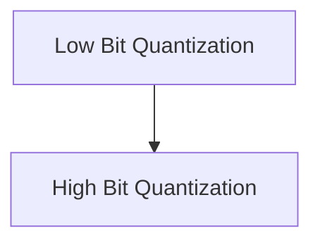

# K-Row Quantization Module

## Introduction
The `k_row_quantization` module is a critical component within the `ggml_cpu_quants_generic` module, specifically designed for efficient quantization of rows for various bit precisions. This module provides optimized functions for converting floating-point data into lower-precision integer formats (Q2_K, Q3_K, Q4_K, Q5_K, Q6_K, Q8_K), which is essential for reducing memory footprint and accelerating computations in machine learning models, especially on CPU architectures.

## Architecture Overview
The `k_row_quantization` module is structured into two main sub-modules: `low_bit_quantization` and `high_bit_quantization`. These sub-modules encapsulate different quantization schemes based on their bit precision, allowing for modular development and maintenance. Both sub-modules provide specialized functions to handle the conversion of data into their respective quantized formats, leveraging reference implementations for core logic.

<!-- DIAGRAM_JSON
{
    "direction": "TD",
    "nodes": [
        {"id": "low_bit_quantization", "label": "Low Bit Quantization", "type": "module", "link": "low_bit_quantization.md"},
        {"id": "high_bit_quantization", "label": "High Bit Quantization", "type": "module", "link": "high_bit_quantization.md"}
    ],
    "edges": [
        {"source": "low_bit_quantization", "target": "high_bit_quantization", "label": "Related Quantization Levels"}
    ],
    "groups": []
}
-->

## Sub-modules

### [Low Bit Quantization](low_bit_quantization.md)
This sub-module focuses on quantizing rows to lower bit precisions, specifically Q2_K, Q3_K, and Q4_K. It includes functions designed to efficiently reduce the memory footprint of data while maintaining acceptable levels of accuracy for specific use cases.

### [High Bit Quantization](high_bit_quantization.md)
This sub-module handles the quantization of rows to higher bit precisions, encompassing Q5_K, Q6_K, and Q8_K. The functions within this module aim to strike a balance between memory efficiency and computational accuracy, providing options for scenarios requiring more precision than lower bit quantizations.