# kv_cache_and_state
This module manages a key-value cache for language model states, supporting efficient branching, conversation resumption, and eviction policies. It provides mechanisms for creating and reusing branches, handling user-defined restore points, and ensuring active conversations are preserved during cache eviction.

<!-- DIAGRAM_JSON
{
  "nodes": [
    {"id": "kv_cache_and_state", "label": "kv_cache_and_state"},
    {"id": "T1", "label": "TestUserSnapshotPreservesRestorePoint"},
    {"id": "T2", "label": "TestBranchCreationAndReuse"},
    {"id": "T3", "label": "TestExactMatchSeedBehavior"},
    {"id": "T4", "label": "TestConversationResumption"},
    {"id": "T5", "label": "TestUserSnapshotResistsAutoMerge"},
    {"id": "T6", "label": "TestBranchSwitchRestoresCorrectState"},
    {"id": "T7", "label": "TestEvictionPreservesActiveConversations"},
    {"id": "T8", "label": "TestLRUOnlyUpdatesUsedNodes"}
  ],
  "edges": [
    {"source": "kv_cache_and_state", "target": "T1", "label": "tests"},
    {"source": "kv_cache_and_state", "target": "T2", "label": "tests"},
    {"source": "kv_cache_and_state", "target": "T3", "label": "tests"},
    {"source": "kv_cache_and_state", "target": "T4", "label": "tests"},
    {"source": "kv_cache_and_state", "target": "T5", "label": "tests"},
    {"source": "kv_cache_and_state", "target": "T6", "label": "tests"},
    {"source": "kv_cache_and_state", "target": "T7", "label": "tests"},
    {"source": "kv_cache_and_state", "target": "T8", "label": "tests"}
  ],
  "groups": [
    {"id": "Branching_Path_Management", "label": "Branching & Path Management", "nodes": ["T2", "T6"]},
    {"id": "Snapshot_Restore_Points", "label": "Snapshot & Restore Points", "nodes": ["T1", "T5"]},
    {"id": "Eviction_LRU", "label": "Eviction & LRU", "nodes": ["T7", "T8"]},
    {"id": "Cache_Hit_Conversation_Flow", "label": "Cache Hit & Conversation Flow", "nodes": ["T3", "T4"]}
  ]
}
-->

```mermaid
flowchart TD
    subgraph Branching & Path Management
        T2[TestBranchCreationAndReuse]
        T6[TestBranchSwitchRestoresCorrectState]
    end

    subgraph Snapshot & Restore Points
        T1[TestUserSnapshotPreservesRestorePoint]
        T5[TestUserSnapshotResistsAutoMerge]
    end

    subgraph Eviction & LRU
        T7[TestEvictionPreservesActiveConversations]
        T8[TestLRUOnlyUpdatesUsedNodes]
    end

    subgraph Cache Hit & Conversation Flow
        T3[TestExactMatchSeedBehavior]
        T4[TestConversationResumption]
    end

    kv_cache_and_state --> T1
    kv_cache_and_state --> T2
    kv_cache_and_state --> T3
    kv_cache_and_state --> T4
    kv_cache_and_state --> T5
    kv_cache_and_state --> T6
    kv_cache_and_state --> T7
    kv_cache_and_state --> T8
```
