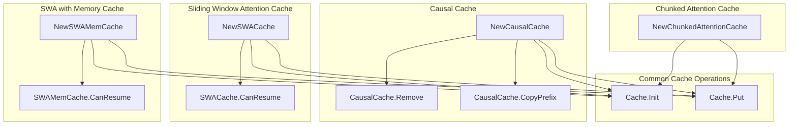

# kv_cache_management
This module provides various key-value cache implementations for attention mechanisms, including causal, sliding window, and chunked attention caches, supporting operations like initialization, data storage, and state querying.

<!-- DIAGRAM_JSON
{
    "nodes": [
        {
            "id": "A",
            "label": "NewCausalCache"
        },
        {
            "id": "B",
            "label": "CausalCache.Remove"
        },
        {
            "id": "C",
            "label": "CausalCache.CopyPrefix"
        },
        {
            "id": "D",
            "label": "NewSWACache"
        },
        {
            "id": "E",
            "label": "SWACache.CanResume"
        },
        {
            "id": "F",
            "label": "NewSWAMemCache"
        },
        {
            "id": "G",
            "label": "SWAMemCache.CanResume"
        },
        {
            "id": "H",
            "label": "NewChunkedAttentionCache"
        },
        {
            "id": "I",
            "label": "Cache.Init"
        },
        {
            "id": "J",
            "label": "Cache.Put"
        }
    ],
    "edges": [
        {
            "source": "A",
            "target": "B",
            "label": "manages"
        },
        {
            "source": "A",
            "target": "C",
            "label": "manages"
        },
        {
            "source": "A",
            "target": "I",
            "label": "uses"
        },
        {
            "source": "A",
            "target": "J",
            "label": "uses"
        },
        {
            "source": "D",
            "target": "E",
            "label": "queries"
        },
        {
            "source": "D",
            "target": "I",
            "label": "uses"
        },
        {
            "source": "D",
            "target": "J",
            "label": "uses"
        },
        {
            "source": "F",
            "target": "G",
            "label": "queries"
        },
        {
            "source": "F",
            "target": "I",
            "label": "uses"
        },
        {
            "source": "F",
            "target": "J",
            "label": "uses"
        },
        {
            "source": "H",
            "target": "I",
            "label": "uses"
        },
        {
            "source": "H",
            "target": "J",
            "label": "uses"
        }
    ],
    "groups": [
        {
            "id": "CausalCache",
            "label": "Causal Cache",
            "nodes": [
                "A",
                "B",
                "C"
            ]
        },
        {
            "id": "SWACache",
            "label": "Sliding Window Attention Cache",
            "nodes": [
                "D",
                "E"
            ]
        },
        {
            "id": "SWAMemCache",
            "label": "SWA with Memory Cache",
            "nodes": [
                "F",
                "G"
            ]
        },
        {
            "id": "ChunkedAttentionCache",
            "label": "Chunked Attention Cache",
            "nodes": [
                "H"
            ]
        },
        {
            "id": "CommonCacheOperations",
            "label": "Common Cache Operations",
            "nodes": [
                "I",
                "J"
            ]
        }
    ]
}
-->
