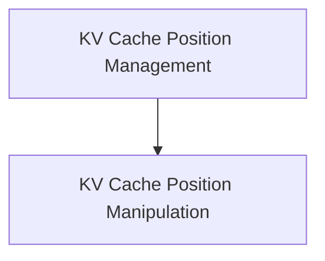

# KV Cache Position Management

## Introduction

The `kv_cache_position_management` module is a critical component within the `llama_cpp_kv_cache` system, responsible for efficiently managing and manipulating the positional indices of KV cache cells. This module ensures accurate tracking of token positions, which is fundamental for language model operations such as attention mechanisms and sequence generation.

## Architecture Overview

The `kv_cache_position_management` module primarily focuses on the core operations related to position adjustments within the KV cache. It interacts with the `kv_cache_cell_lifecycle` module to maintain the integrity and state of individual cache cells during position changes.

<!-- DIAGRAM_JSON
{
    "direction": "TD",
    "nodes": [
        {"id": "position_manipulation", "label": "KV Cache Position Manipulation", "type": "module", "link": "position_manipulation.md"}
    ],
    "edges": [],
    "groups": []
}
-->

## Sub-modules

### KV Cache Position Manipulation (`position_manipulation.md`)

This sub-module, documented in `position_manipulation.md`, provides the core functionalities for adjusting positions of KV cache entries. It includes operations like `pos_add` for incrementing positions and `pos_div` for dividing positions, along with managing associated shifts and handling invalid positions.