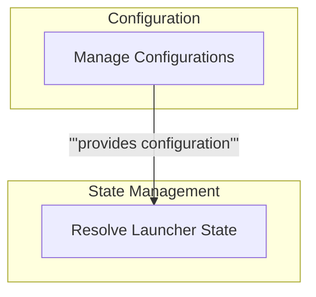

# Launcher State and Configuration

This module manages the application's operational state, including configuration settings for models and integrations, and dynamically resolves model availability and usage based on saved preferences and system status.

<!-- DIAGRAM_JSON
{
    "direction": "TD",
    "nodes": [
        {"id": "config_management", "label": "Manage Configurations", "type": "module", "link": "configuration_management.md"},
        {"id": "state_resolution", "label": "Resolve Launcher State", "type": "module", "link": "launcher_state_resolution.md"}
    ],
    "edges": [
        {"source": "config_management", "target": "state_resolution", "label": "provides configuration"}
    ],
    "groups": [
        {"id": "config", "label": "Configuration", "role": "data", "nodes": ["config_management"]},
        {"id": "state", "label": "State Management", "role": "analytical", "nodes": ["state_resolution"]}
    ]
}
-->
