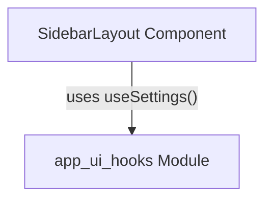

# Module: `layout_components`

## Introduction
The `layout_components` module provides foundational UI layout components, specifically focusing on responsive and adaptable layouts with sidebars. It is a leaf module within the `app_ui_components.utility_ui_components` hierarchy, offering reusable structures for the application's user interface.

## Core Functionality
The primary component within this module is `SidebarLayout`. This component is designed to render a main content area alongside a collapsible sidebar. It intelligently adjusts its layout based on user settings and environment (e.g., Windows platform) to ensure a consistent and user-friendly experience.

### `SidebarLayout` Component
The `SidebarLayout` component serves as a container for two main areas: a `sidebar` and the `children` (main content).
It leverages the application's settings to control the visibility and positioning of the sidebar, including dynamic adjustments for different operating systems.

**Key features:**
*   **Dynamic Sidebar Control:** Integrates with application settings (`useSettings`) to manage the open/closed state of the sidebar.
*   **Platform-aware Styling:** Adjusts sidebar positioning based on the detected operating system (e.g., Windows) to optimize visual alignment.
*   **Content Projection:** Allows for flexible content insertion into both the sidebar and the main content area via `sidebar` and `children` props.
*   **Styling:** Utilizes Tailwind CSS classes for responsive design, transitions, and dark mode compatibility.

## Architecture and Component Relationships

<!-- DIAGRAM_JSON
{
    "direction": "TD",
    "nodes": [
        {"id": "sidebar_layout", "label": "SidebarLayout Component", "type": "component", "link": null},
        {"id": "app_ui_hooks", "label": "app_ui_hooks Module", "type": "external", "link": "app_ui_hooks.md"}
    ],
    "edges": [
        {"source": "sidebar_layout", "target": "app_ui_hooks", "label": "uses useSettings()"}
    ],
    "groups": []
}
-->

### Component Breakdown:

*   **`SidebarLayout`**: The central component of this module. It is a React functional component that accepts `sidebar` and `children` as props, along with optional `collapsible` and `chatId` props. It internally uses the `useSettings` hook to manage its state and `navigator.platform` for environment-specific rendering logic.

### External Dependencies:

*   **`app_ui_hooks`**: The `SidebarLayout` component depends on the `useSettings` hook, which is presumed to be provided by the `app_ui_hooks` module. This hook is crucial for retrieving and updating application-wide settings, including the sidebar's open/closed state. For more details, refer to the [app_ui_hooks documentation](app_ui_hooks.md).

## Integration with Overall System
The `layout_components` module, specifically `SidebarLayout`, is a fundamental building block for the application's user interface. It provides a standardized and responsive layout structure that can be adopted by various parts of the application requiring a sidebar navigation or supplementary content area. It integrates seamlessly with the broader `app_ui_components` ecosystem, receiving its content and behavior cues from parent and sibling UI components.
