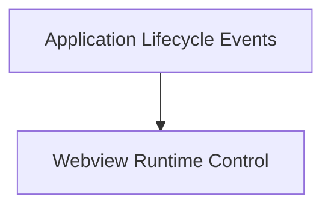

# Lifecycle Management Module

## Introduction
The `lifecycle_management` module is a critical component within the `app_webview_api.core_webview_operations` module, responsible for orchestrating the fundamental phases of the webview application's existence. It encompasses functions for initializing the webview, managing its execution flow, dispatching events, and gracefully handling application termination. This module ensures the proper startup, operation, and shutdown of the webview, integrating closely with the underlying platform's application lifecycle.

## Architecture
The `lifecycle_management` module is structured into the following key sub-modules:

*   **Application Lifecycle Events**: Manages actions and configurations during significant application lifecycle events, such as when the application has finished launching.
*   **Webview Runtime Control**: Provides core functionalities to control the webview's execution, including starting and stopping its main loop, dispatching tasks, and initial setup.

These sub-modules work in concert to provide a robust framework for managing the webview's operational lifecycle.

<!-- DIAGRAM_JSON
{
    "direction": "TD",
    "nodes": [
        {"id": "application_lifecycle_events", "label": "Application Lifecycle Events", "type": "module", "link": "application_lifecycle_events.md"},
        {"id": "webview_runtime_control", "label": "Webview Runtime Control", "type": "module", "link": "webview_runtime_control.md"}
    ],
    "edges": [
        {"source": "application_lifecycle_events", "target": "webview_runtime_control"}
    ],
    "groups": []
}
-->

## Sub-modules Overview

### [Application Lifecycle Events](application_lifecycle_events.md)
This sub-module is dedicated to handling critical events during the application's lifecycle, particularly the initialization phase. It manages operations that need to occur once the application has finished launching, such as window setup and application activation policies.

### [Webview Runtime Control](webview_runtime_control.md)
The `webview_runtime_control` sub-module provides the essential functions for directly managing the webview's operational state. This includes starting and stopping the webview's main processing loop, dispatching arbitrary functions for execution within the webview's context, and performing initial JavaScript-based setup.
