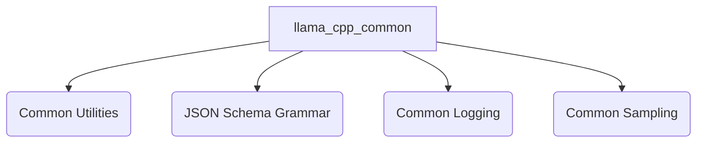

## Module: `llama_cpp_common`

### Purpose
The `llama_cpp_common` module serves as a foundational library within the `llama.cpp` project, providing a comprehensive suite of common utilities and core functionalities. Its purpose is to centralize essential helper components, including system and file management, string manipulation, model initialization and optimization, JSON schema to GBNF grammar conversion, standardized logging, and token sampling mechanisms. This module ensures consistency, reusability, and efficient operation across various parts of the `llama.cpp` ecosystem.

### Architecture Overview
The `llama_cpp_common` module is structured into several distinct sub-modules, each addressing a specific area of common functionality. These sub-modules are designed to be loosely coupled, providing specialized services that are critical for the overall `llama.cpp` project.

### Core Components Documentation
The `llama_cpp_common` module is composed of the following key sub-modules:

*   **[Common Utilities (`common_utils`)](common_utils.md)**: Provides essential utility functions for system parameter handling, file system operations, string manipulation, model initialization, and optimizer parameter management.
*   **[json_schema_grammar](json_schema_grammar.md)**: Responsible for converting JSON schema definitions into GBNF (GGML BNF) grammar, enabling structured data generation and validation.
*   **[Common Logging](common_logging.md)**: Offers a standardized logging mechanism for the `llama.cpp` project, ensuring consistent log message handling, filtering, and output.
*   **[Common Sampling](common_sampling.md)**: Encapsulates fundamental utilities and core logic for token sampling, including mechanisms for sampling tokens from probabilities and converting sampler configurations.