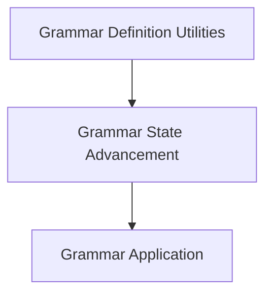

# Llama C++ Grammar Module Documentation

## Introduction and Purpose

The `llama_cpp_grammar` module in `llama.cpp` is a critical component responsible for enforcing grammatical constraints during the text generation process. Its primary purpose is to ensure that the output tokens conform to a predefined grammar, allowing for the generation of structured and syntactically correct text, such as JSON, code, or other domain-specific languages. This module enables developers to guide the language model's output, significantly enhancing control and reliability in applications requiring specific formats.

## Architecture Overview

The `llama_cpp_grammar` module is logically structured into several sub-modules, each handling a distinct aspect of grammar processing. This modular design promotes maintainability and clarity, separating concerns related to grammar application, state advancement, and definition utilities.

<!-- DIAGRAM_JSON
{
    "direction": "TD",
    "nodes": [
        {"id": "grammar_application", "label": "Grammar Application", "type": "module", "link": "grammar_application.md"},
        {"id": "grammar_state_advancement", "label": "Grammar State Advancement", "type": "module", "link": "grammar_state_advancement.md"},
        {"id": "grammar_definition_utilities", "label": "Grammar Definition Utilities", "type": "module", "link": "grammar_definition_utilities.md"}
    ],
    "edges": [
        {"source": "grammar_state_advancement", "target": "grammar_application"},
        {"source": "grammar_definition_utilities", "target": "grammar_state_advancement"}
    ],
    "groups": []
}
-->

## Sub-modules

### [Grammar Application](grammar_application.md)
This sub-module focuses on applying the defined grammar rules to a set of candidate tokens. It determines which tokens are valid according to the current grammar state and prunes invalid options, ensuring only grammatically correct continuations are considered.

### [Grammar State Advancement](grammar_state_advancement.md)
This sub-module is responsible for updating the internal state of the grammar based on accepted string pieces or individual tokens. It processes incoming text/tokens, advances the grammar's parsing position, and handles features like trigger patterns that can dynamically alter grammar behavior.

### [Grammar Definition Utilities](grammar_definition_utilities.md)
This sub-module provides essential utility functions for working with grammar definitions. It includes functionalities like parsing individual characters (handling escape sequences and Unicode) and pretty-printing grammar rules for debugging or inspection purposes.
