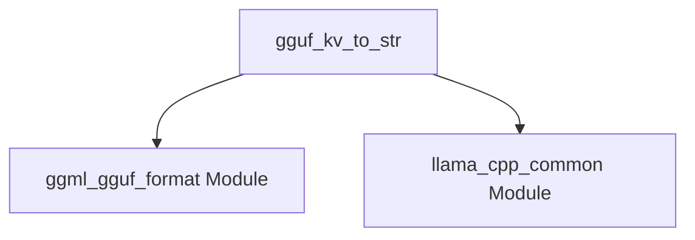

# llama_cpp_impl Module Documentation

## Introduction

The `llama_cpp_impl` module serves as a core implementation layer within the `llama.cpp` project, providing fundamental functionalities for data handling and conversion. Its primary role is to bridge internal data structures with external representations, ensuring data integrity and readability.

## Core Functionality

The main component of this module, `gguf_kv_to_str`, is responsible for converting key-value pairs from the GGUF (GGML Universal Format) context into string representations. This function is crucial for serialization, debugging, and user-facing displays of model metadata.

### `gguf_kv_to_str` Function

The `gguf_kv_to_str` function takes a GGUF context and a key-value index, then determines the type of the value and converts it into an appropriate string format. It handles various GGUF types, including basic types, strings, and arrays.

**Parameters:**
- `ctx_gguf`: A pointer to the `gguf_context` structure, providing access to the GGUF data.
- `i`: An integer representing the index of the key-value pair within the GGUF context.

**Return Value:**
- A `std::string` representing the converted value.

**Detailed Behavior:**
- **String Type (`GGUF_TYPE_STRING`):** Directly retrieves the string value and returns it.
- **Array Type (`GGUF_TYPE_ARRAY`):** Iterates through the array elements, converting each element to a string and concatenating them into a JSON-like array string.
  - String elements within an array are properly escaped (e.g., `\` becomes `\\\\`, `"` becomes `\"`).
  - Nested arrays are represented as "???".
  - Other array types use `gguf_data_to_str` for conversion.
- **Other Types (Default):** Uses `gguf_data_to_str` to convert the data directly to a string.

## Architecture and Component Relationships

The `llama_cpp_impl` module, specifically the `gguf_kv_to_str` function, depends on external modules for GGUF context management and general string utility operations.

<!-- DIAGRAM_JSON
{
    "direction": "TD",
    "nodes": [
        {"id": "gguf_kv_to_str", "label": "gguf_kv_to_str", "type": "component", "link": null},
        {"id": "ggml_gguf_format", "label": "ggml_gguf_format Module", "type": "external", "link": "ggml_gguf_format.md"},
        {"id": "llama_cpp_common", "label": "llama_cpp_common Module", "type": "external", "link": "llama_cpp_common.md"}
    ],
    "edges": [
        {"source": "gguf_kv_to_str", "target": "ggml_gguf_format"},
        {"source": "gguf_kv_to_str", "target": "llama_cpp_common"}
    ],
    "groups": []
}
-->

## How the Module Fits into the Overall System

The `llama_cpp_impl` module plays a vital role in the `llama.cpp` ecosystem by providing the necessary logic to interpret and represent GGUF metadata. This is essential for:
- **Model Loading and Configuration:** When loading GGUF models, this module helps in parsing and understanding the metadata, such as model parameters, tokenizer information, and other custom key-value pairs.
- **Debugging and Logging:** The string conversion capabilities are invaluable for debugging model behavior and logging internal states in a human-readable format.
- **Interoperability:** By converting GGUF data to a standard string format, it facilitates interoperability with other tools and systems that might consume or display this information.

It acts as a utility layer that is invoked whenever GGUF key-value data needs to be presented or processed in a string format, thereby supporting higher-level functionalities in model management and execution.
