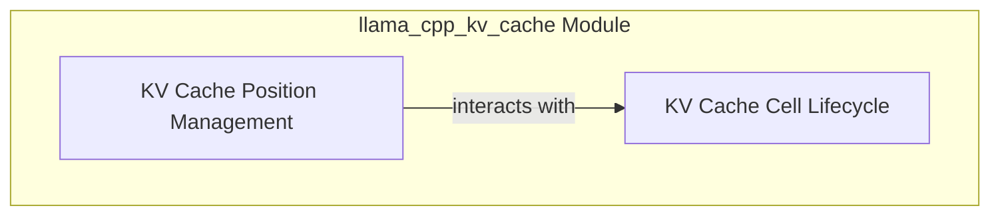

# llama_cpp_kv_cache Module Documentation

## Introduction

The `llama_cpp_kv_cache` module is a critical component within the Llama.cpp inference engine, primarily responsible for managing the Key-Value (KV) cache cells. This cache is essential for efficient generation of sequences by storing previously computed keys and values from transformer layers, preventing redundant computations. The module provides core functionalities for manipulating the state, position, and lifecycle of these KV cache cells.

## Architecture Overview

The `llama_cpp_kv_cache` module is structured into logical sub-modules, each handling a specific aspect of KV cache cell management. These sub-modules interact to ensure proper state transitions, positional adjustments, and overall integrity of the KV cache.

<!-- DIAGRAM_JSON
{
    "direction": "TD",
    "nodes": [
        {"id": "kv_cache_position_management", "label": "KV Cache Position Management", "type": "module", "link": "kv_cache_position_management.md"},
        {"id": "kv_cache_cell_lifecycle", "label": "KV Cache Cell Lifecycle", "type": "module", "link": "kv_cache_cell_lifecycle.md"}
    ],
    "edges": [
        {"source": "kv_cache_position_management", "target": "kv_cache_cell_lifecycle", "label": "interacts with"}
    ],
    "groups": []
}
-->

## High-Level Functionality

### KV Cache Position Management
This sub-module focuses on the manipulation of the positional attributes of KV cache cells. It includes operations for adjusting the logical position of tokens within the cache, which is vital for handling sequence shifts and re-indexing.
For more details, refer to the [KV Cache Position Management Documentation](kv_cache_position_management.md).

### KV Cache Cell Lifecycle
The `kv_cache_cell_lifecycle` sub-module is responsible for the overall management of KV cache cell states. This includes operations to retain cells for specific sequences, mark cells for removal, or invalidate them entirely, ensuring efficient memory usage and correct sequence processing.
For more details, refer to the [KV Cache Cell Lifecycle Documentation](kv_cache_cell_lifecycle.md).
