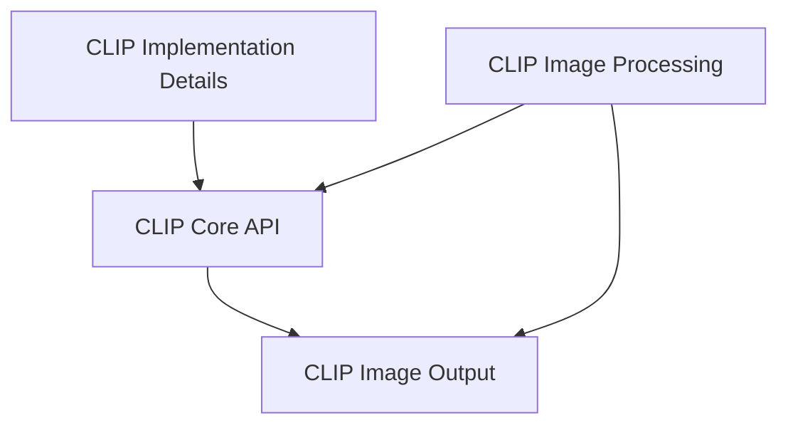

## Overview of `llama_cpp_mtmd_clip` Module

### Purpose of the Module

The `llama_cpp_mtmd_clip` module integrates CLIP (Contrastive Language-Image Pre-training) model functionalities into the `llama.cpp` ecosystem, enabling multimodal capabilities. It provides core utilities, model initialization, image encoding, comprehensive image preprocessing, batch management, and image output functionalities for visual data. This module is crucial for applications that require the `llama.cpp` backend to process and understand image or audio inputs using CLIP models.

### Architecture of the Module

The `llama_cpp_mtmd_clip` module is composed of several key sub-modules, each handling a specific aspect of CLIP model integration and multimodal data processing.

### References to Core Components Documentation

The following are the core sub-modules within `llama_cpp_mtmd_clip`, with links to their detailed documentation:

*   **[CLIP Implementation Details](clip_implementation_details.md)**: Provides core utilities, data structures, and logging mechanisms fundamental to the CLIP model's operation within `llama.cpp`.
*   **[CLIP Core API](clip_core_api.md)**: Offers the primary functionalities for interacting with the CLIP model, including initialization, image encoding, and embedding utilities.
*   **[CLIP Image Processing](clip_image_processing.md)**: Contains a comprehensive set of functionalities for handling and preparing image data, including preprocessing and batch management.
*   **[clip_image_output](clip_image_output.md)**: Responsible for handling the output and saving of processed image data to various file formats.