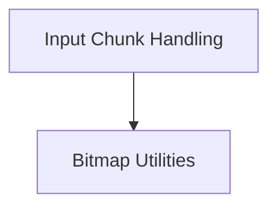

# Llama CPP Multi-modal Core (llama_cpp_mtmd_core)

## Introduction and Purpose

The `llama_cpp_mtmd_core` module serves as the central processing unit for handling multi-modal inputs within the Llama CPP framework. It is responsible for orchestrating the encoding of diverse data types—such as text, images, and audio—into a unified format suitable for consumption by the Llama model. This module provides essential functions for managing and querying properties of these multi-modal input chunks, ensuring seamless integration and processing across different modalities.

## Architecture Overview

The `llama_cpp_mtmd_core` module is structured around key functionalities for processing and managing multi-modal input chunks. It interacts with other modules for specific encoding tasks (e.g., vision and audio contexts).

<!-- DIAGRAM_JSON
{
    "direction": "TD",
    "nodes": [
        {"id": "input_chunk_handling", "label": "Input Chunk Handling", "type": "module", "link": "input_chunk_handling.md"},
        {"id": "bitmap_utilities", "label": "Bitmap Utilities", "type": "module", "link": "bitmap_utilities.md"}
    ],
    "edges": [
        {"source": "input_chunk_handling", "target": "bitmap_utilities"}
    ],
    "groups": []
}
-->

## High-Level Functionality

### Input Chunk Handling

This sub-module, detailed in [input_chunk_handling.md](input_chunk_handling.md), is responsible for the core operations related to multi-modal input chunks. It includes functions for encoding chunks of different types (text, image, audio) and for retrieving metadata such as the number of tokens and positions associated with each chunk.

### Bitmap Utilities

The [bitmap_utilities.md](bitmap_utilities.md) sub-module provides essential helper functions, specifically for managing and querying bitmap-related data. Its primary function is to return the size in bytes of a given bitmap, facilitating memory management and data integrity checks within the multi-modal processing pipeline.
