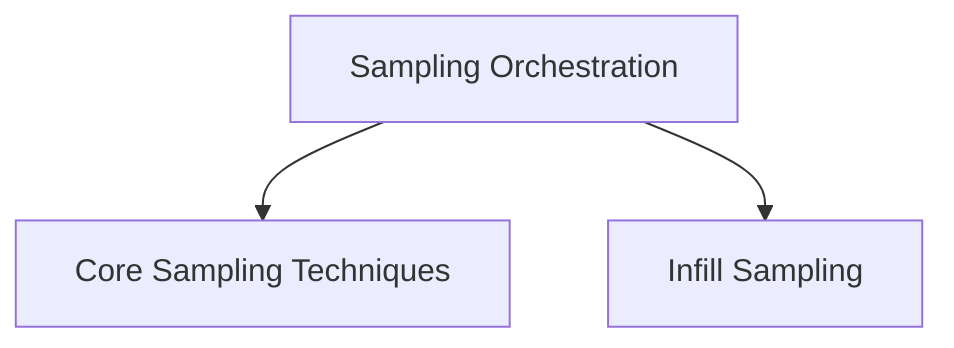

# Llama_cpp_sampling Module Documentation

## Introduction

The `llama_cpp_sampling` module is responsible for implementing various token sampling strategies used in the `llama.cpp` project. It provides a flexible framework for applying different algorithms to determine the next token in a sequence, influencing the generated text's characteristics such as creativity, coherence, and adherence to specific patterns.

## Architecture Overview

The `llama_cpp_sampling` module is composed of several sub-modules, each handling a specific aspect of the token sampling process. The `sampling_orchestration` sub-module acts as the central coordinator, utilizing the `core_sampling_techniques` and `infill_sampling` sub-modules to apply the desired sampling logic.

<!-- DIAGRAM_JSON
{
    "direction": "TD",
    "nodes": [
        {"id": "core_sampling_techniques", "label": "Core Sampling Techniques", "type": "module", "link": "core_sampling_techniques.md"},
        {"id": "infill_sampling", "label": "Infill Sampling", "type": "module", "link": "infill_sampling.md"},
        {"id": "sampling_orchestration", "label": "Sampling Orchestration", "type": "module", "link": "sampling_orchestration.md"}
    ],
    "edges": [
        {"source": "sampling_orchestration", "target": "core_sampling_techniques"},
        {"source": "sampling_orchestration", "target": "infill_sampling"}
    ],
    "groups": []
}
-->

## Sub-modules

Here's a high-level overview of the sub-modules within `llama_cpp_sampling`:

### [Core Sampling Techniques](core_sampling_techniques.md)
This sub-module implements various core token sampling techniques such as Top-K, Top-P, Mirostat, and dynamic temperature scaling.

### [Infill Sampling](infill_sampling.md)
This sub-module provides specialized sampling logic for infill scenarios, handling EOG tokens and token prefix combinations.

### [Sampling Orchestration](sampling_orchestration.md)
This sub-module manages the overall token sampling process and sampler chain resets.
